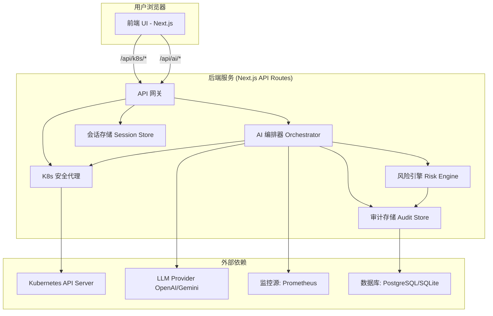

# **0. 项目名称 (Project Name)**

KubeCopilot

# **1. 项目愿景与定位 (Vision & Positioning)**

- **最终愿景 (Ultimate Vision)**: 成为 SRE 和 DevOps 工程师的“Kubernetes 智能驾驶舱” (AI-Powered DevOps Cockpit)。它不仅仅是“看见”集群，更是能够“理解”集群状态，并能“建议”甚至“半自动执行”最佳实践操作的智能伙伴。
- **当前定位 (Positioning)**: 一款**AI 增强的、轻量级的 Kubernetes 可视化面板**。我们从解决“看板只显示不解释”的痛点切入，逐步构建信任，最终实现完整的驾驶舱愿景。我们的定位介于“只读信息面板”和“全自动 PaaS 平台”之间。

# **2. 指导原则 / 设计哲学 (Guiding Principles)**

- **AI Native (AI 原生)**: AI 不是附属品，而是核心交互和价值的来源。所有功能设计都将优先考虑如何利用 AI 提升效率和降低认知负担。
- **MVP 优先 (MVP First)**: 严格遵循 P0 -> P1 -> P2 的优先级。先交付一个能用 AI “解释”集群的最小可用产品，验证核心价值，再逐步引入“写入”和“自动化”能力。
- **安全默认 (Secure by Default)**: 所有写操作都必须经过 `OperationPlan` 的结构化审查。Kubeconfig 等敏感凭证的处理沿用最高安全标准，后端是唯一与 K8s API 通信的组件。
- **结构化与可审计 (Structured & Auditable)**: AI 的任何输出，特别是写操作建议，都必须是结构化的、可被机器校验的 (Schema-First)。所有变更必须留下清晰、不可篡改的审计日志。
- **开发者体验至上 (DX First)**: 无论是最终用户的使用体验，还是我们自身的开发流程，都追求简洁、流畅和高效。
- 参考**《SRE Google运维解密》**

# 3. 角色与职责 (Roles & Responsibilities)

- **Human Developer**: 项目负责人 & 主程 (Project Lead & Lead Developer)。
- **Gemini (AI in this web chat)**: AI 架构师 & 系统设计师 (AI Architect & System Designer)。
- **本地 IDE AI (Copilot, etc.)**: AI 结对程序员 (AI Pair Programmer)。

### 3.1 AI 协作模型 (AI Collaboration Model)

- **目标**: 为解决 AI 无法直接访问本地代码库导致的上下文缺失问题，并提升长期协作效率，我们采纳一个**分层协作模型**，为不同的协作场景指定最高效的工具。

- **模型分层**:
    1.  **Gemini (Web Chat) - 战略指挥室 (Strategy Room)**:
        - **职责**: 负责 SSOT 的维护、高阶架构设计、Roadmap 规划、核心技术决策和方向性问题的讨论。
        - **定位**: 定义项目的 **“Why”** 和 **“What”**。

    2.  **本地 IDE AI (VS Code w/ AI, GitHub Copilot) - 结对程序员 (Pair Programmer)**:
        - **职责**: 在 IDE 中提供实时的代码自动补全、函数生成、代码片段解释和重构建议。
        - **定位**: 辅助完成 **“How”** 的一线编码工作，它拥有完整的本地文件上下文。

    3.  **Gemini CLI - 代码审查员 (Code Reviewer)**:
        - **职责**: 在不离开终端的情况下，对单个或多个本地文件进行按需的、指令式的深度分析、审查和优化。
        - **定位**: 解决“需要架构师审查本地代码，但又不想复制粘贴”的场景，是连接本地开发与战略审查的桥梁。

- **推荐工作流**:
    1.  **规划 (Web Chat)**: 在战略指挥室中共同确定下一个开发任务。
    2.  **编码 (IDE)**: 在本地使用 AI 结对程序员高效编写代码。
    3.  **审查 (CLI)**: (可选) 当需要对特定实现进行反馈时，使用 CLI 让 AI 对本地代码进行审查。
    4.  **同步 (Web Chat)**: 完成任务后，在战略指挥室同步进度，并规划下一步行动。

# 4. 技术栈 (Tech Stack)

- **核心框架**: Next.js 14 (App Router), TypeScript
    - *理由*: 全栈能力，统一前后端开发体验，完美契合我们“前端 UI + 后端安全代理/AI 编排器”的架构。
- **UI 框架**: Tailwind CSS, shadcn/ui, Magic UI
    - *理由*: 高度可定制的原子化 CSS，结合预制、符合无障碍标准的优美组件，能极大地提升开发效率和 UI 质量。
- **状态管理**: Zustand
    - *理由*: 轻量、简洁、无模板代码。对于需要跨组件共享的状态（如当前选择的 Namespace、集群连接状态），它是最理想的选择。
- **后端核心**:
    - **K8s 客户端**: @kubernetes/client-node
        - *理由*: CNCF 官方 Node.js 客户端，是与 Kubernetes API Server 通信的标准和最可靠的方式。
    - **数据库 ORM**: Prisma
        - *理由*: 提供类型安全的数据库访问，简化数据库迁移和查询。能与 PostgreSQL (生产) 和 SQLite (本地开发) 无缝协作，是 Audit Store 和 OperationPlan 持久化的最佳选择。
    - **数据库**: PostgreSQL (生产推荐), SQLite (本地开发)
        - *理由*: PostgreSQL 功能强大、稳定可靠；SQLite 轻量零配置，非常适合本地快速启动和测试。
- **AI 与数据校验**:
    - **LLM 客户端**: openai 或 @google/generative-ai
        - *理由*: 用于与大语言模型 API（如 OpenAI GPT 系列或 Google Gemini 系列）进行交互。
    - **Schema 校验**: Zod
        - *理由*: **AI Native 架构的基石**。用于在后端严格校验 LLM 返回的 JSON 是否符合我们定义的 OperationPlan 等 Schema，确保 AI 输出的可靠性和安全性。
- **编辑器与可视化**:
    - **YAML 编辑器**: @monaco-editor/react
        - *理由*: VS Code 的核心编辑器，提供一流的 YAML 编辑、语法高亮和校验体验，是 YAML Copilot 功能的不二之选。
    - **[未来] 数据图表**: Recharts
        - *理由*: 简单、组件化的图表库，非常适合未来集成 Prometheus 指标，展示 CPU/内存等监控图表。
- **代码质量**: ESLint, Prettier, Husky
    - *理由*: 保证代码风格统一、质量可靠的行业标准三件套。
- **认证与会话管理库**:
    - jsonwebtoken 和 bcryptjs。
    - **理由**: 在“集群连接 & 基础布局”中，我们需要安全地管理用户会话。jsonwebtoken (JWT) 是实现无状态认证的行业标准，可以用来签发一个有时效性的 token，证明用户已成功连接。即便我们初期仅将会话信息存在内存中，使用 JWT 也是一个更规范、更安全的实践。bcryptjs 则是在我们未来可能支持用户名/密码登录时，用于密码哈希的标准库，提前纳入考量体现了我们的安全前瞻性。
- **日志库**:
    - pino 或 winston。
    - **理由**: 一个好的后端服务必须有结构化的日志。pino 以其极高的性能和 JSON 结构化日志输出而著称，非常适合在 API 路由中记录请求、AI 操作、错误等信息，便于未来的日志分析和告警。

---

# 5. 项目结构 (Project Structure)

## **5.1 规划的项目结构**
```
kubecopilot/
├── prisma/                 # Prisma 目录，存放数据库 Schema 和迁移文件
│   └── schema.prisma
├── prompts/                # 存放所有 LLM 的 Prompt 模板，便于管理和版本控制
│   ├── diagnose-pod.md
│   └── generate-operation-plan.md
├── src/
│   ├── app/
│   │   ├── (dashboard)/      # 认证后才能访问的主看板布局和路由 (例如 /pods, /deployments)
│   │   │   ├── layout.tsx
│   │   │   └── page.tsx      # 集群概览页
│   │   ├── connect/          # Kubeconfig 连接页面
│   │   │   └── page.tsx
│   │   └── api/              # 后端 API 路由
│   │       ├── ai/             # AI 编排器核心端点
│   │       │   ├── diagnose/   # AI 诊断 API
│   │       │   ├── execute/    # 执行已确认的 OperationPlan
│   │       │   └── plan/       # 根据用户意图生成 OperationPlan
│   │       └── k8s/            # 作为安全代理，转发请求到 K8s API Server
│   │           ├── namespaces/ # 【MVP 策略】为每个资源创建特定路由，以实现安全可控和数据定制化
│   │           ├── pods/
│   │           └── ...
│   │           # [未来 V2] 可能会演进为 [..path] 动态代理模式，以支持更广泛的资源类型
│   ├── components/
│   │   ├── ai/               # AI 专属 UI 组件 (例如 PromptBar, PlanConfirmModal, AiDiagnosisPane)
│   │   ├── ui/               # shadcn/ui 基础组件 (由 CLI 生成)
│   │   ├── layout/           # 页面布局组件 (例如 Sidebar, Header)
│   │   ├── k8s/              # K8s 专用组件 (例如 ResourceTable, StatusBadge)
│   │   └── shared/           # 项目级共享组件 (例如 MonacoEditorWrapper)
│   ├── lib/                  # 核心业务逻辑层 (后端，非 API 路由)
│   │   ├── ai/               # 封装 LLM 客户端、Prompt 格式化、Zod Schema 定义
│   │   ├── audit/            # 审计日志服务，负责写入和读取审计记录
│   │   ├── db.ts             # Prisma 客户端单例初始化
│   │   ├── k8s/              # 封装 @kubernetes/client-node，提供更易用的接口
│   │   ├── risk-engine/      # 风险引擎的实现 (规则 + AI 评分)
│   │   ├── utils.ts          # 通用工具函数
│   │   └── schemas/
│   │       ├── operation-plan.ts # Zod schema for OperationPlan
│   │       └── ai-diagnosis.ts    # Zod schema for AI diagnosis output
│   ├── hooks/                # 自定义 React Hooks (例如 useK8sResource, useAiStream)
│   ├── types/                # 全局 TypeScript 类型定义 (例如 OperationPlan, K8s 资源类型)
│   └── store/                # Zustand 状态管理 store
├── .env.example            # 环境变量示例文件，需用户复制为 .env.local
├── next.config.mjs         # Next.js 配置文件
└── tsconfig.json           # TypeScript 配置文件```
```

## **5.2 当前的项目结构 (Current Project Structure)**

```
/home/dev/projects/kubecopilot/
├───.eslintignore
├───.gitignore
├───.prettierrc.json
├───components.json
├───eslint.config.mjs
├───next.config.ts
├───package-lock.json
├───package.json
├───pnpm-lock.yaml
├───postcss.config.mjs
├───README.md
├───SSOT.md
├───tsconfig.json
├───prisma/
│   └───schema.prisma
├───public/
│   ├───file.svg
│   ├───globe.svg
│   ├───next.svg
│   ├───vercel.svg
│   └───window.svg
└───src/
    ├───middleware.ts
    ├───app/
    │   ├───favicon.ico
    │   ├───globals.css
    │   ├───layout.tsx
    │   ├───(dashboard)/
    │   │   ├───layout.tsx
    │   │   ├───page.tsx
    │   │   ├───deployments/
    │   │   │   ├───page.tsx
    │   │   │   └───[namespace]/
    │   │   │       └───[name]/
    │   │   │           └───page.tsx
    │   │   ├───namespaces/
    │   │   │   ├───page.tsx
    │   │   │   └───[name]/
    │   │   │       └───page.tsx
    │   │   ├───pods/
    │   │   │   ├───page.tsx
    │   │   │   └───[namespace]/
    │   │   │       └───[name]/
    │   │   │           └───page.tsx
    │   │   └───services/
    │   │       ├───page.tsx
    │   │       └───[namespace]/
    │   │           └───[name]/
    │   │               └───page.tsx
    │   ├───api/
    │   │   └───k8s/
    │   │       ├───connect/
    │   │       │   └───route.ts
    │   │       ├───deployments/
    │   │       │   ├───route.ts
    │   │       │   └───[namespace]/
    │   │       │       └───[name]/
    │   │       │           └───route.ts
    │   │       ├───namespaces/
    │   │       │   ├───route.ts
    │   │       │   └───[name]/
    │   │       │       └───route.ts
    │   │       ├───pods/
    │   │       │   ├───route.ts
    │   │       │   └───[namespace]/
    │   │       │       └───[name]/
    │   │       │           └───route.ts
    │   │       └───services/
    │   │           ├───route.ts
    │   │           └───[namespace]/
    │   │               └───[name]/
    │   │                   └───route.ts
    │   └───connect/
    │       └───page.tsx
    ├───components/
    │   ├───k8s/
    │   │   ├───DeploymentInfoCard.tsx
    │   │   ├───DeploymentsTable.tsx
    │   │   ├───EventsTable.tsx
    │   │   ├───NamespaceInfoCard.tsx
    │   │   ├───NamespaceTable.tsx
    │   │   ├───PodContainersCard.tsx
    │   │   ├───PodInfoCard.tsx
    │   │   ├───PodsTable.tsx
    │   │   ├───ServiceInfoCard.tsx
    │   │   └───ServicesTable.tsx
    │   ├───layout/
    │   │   ├───Header.tsx
    │   │   └───Sidebar.tsx
    │   ├───shared/
    │   │   └───ReadOnlyYamlViewer.tsx
    │   └───ui/
    │       ├───alert.tsx
    │       ├───badge.tsx
    │       ├───button.tsx
    │       ├───card.tsx
    │       ├───dropdown-menu.tsx
    │       ├───label.tsx
    │       ├───skeleton.tsx
    │       ├───table.tsx
    │       ├───tabs.tsx
    │       └───textarea.tsx
    ├───hooks/
    │   └───useK8sResource.ts
    └───lib/
        ├───session.ts
        ├───utils.ts
        └───k8s/
            └───client.ts
```

## **5.3 已实现的核心组件与模式**

本节记录项目在代码层面已实现的关键抽象和可复用单元，以反映当前工程进度。
后端:   
    - [x]  K8s 客户端工厂: 在 /lib/k8s/client.ts 中实现了基于 API Group 的客户端创建模式 (getK8sCoreV1Api, getK8sAppsV1Api)。
    - [x]  会话管理: 实现了基于 globalThis 的内存会话存储，确保开发环境的热重载稳定性。
    - [x]  特定资源 API 路由: 确立了为每个 K8s 资源创建独立、安全、定制化 API 路由的模式。
前端:
    - [x]  通用数据获取 Hook: 在 /hooks/useK8sResource.ts 中实现了基于 SWR 的通用数据获取 Hook。
    - [x]  可复用详情页组件: 创建了 EventsTable, ReadOnlyYamlViewer 等可被多个资源详情页复用的核心组件。
    - [x]  Tabs 布局模式: 确立了使用 Tabs 组件来组织详情页信息的标准布局。


# **6. 开发工作流 (Development Workflow)**

### a. 环境管理 (开发 vs. 生产)

- **方案**: 我们将严格使用**环境变量**来管理不同环境的配置。
- **实现**: Next.js 内置了强大的环境变量支持。
    - .env: 存储所有环境共享的变量（会被提交到 git）。
    - .env.local: 存储本地开发的敏感信息或个性化配置（**不会**被提交到 git）。例如，你可以在这里覆盖 API 地址等。
    - .env.production: 存储生产环境的特定配置。
    - next.config.js: 用于管理构建时的环境变量。
- **原则**: 任何可能在不同环境间变化的配置（如 API 超时、日志级别等）都必须通过环境变量注入，而不是硬编码在代码里。

### b. GitHub 分支管理

- **方案**: 采用 **GitHub Flow**，这是一个轻量、高效、适合我们项目规模的分支模型。
- **Commit Message 规范**:
    - **格式**: <type>(<scope>): <subject>，例如：
        - feat(api): implement operation plan generation endpoint
        - fix(ui): correct pod status badge color
        - docs(ssot): refine sre principles section
        - test(husky)：增加测试
    - **理由**: 规范化的 Commit Message 能极大地提高 Git Log 的可读性，便于快速理解每次提交的内容。更重要的是，它可以为自动化工具（如 semantic-release）所用，实现**自动化生成 CHANGELOG 和版本号管理**，这是 DevOps 最佳实践的一部分。
- **规则**:
    1. **main 分支**: 这是项目的主分支，永远处于**可部署**状态。不允许直接 push，所有合并必须通过 Pull Request。
    2. **特性分支 (feat Branches)**:
        - 任何新的功能或修复，都必须从 main 分支创建一个新的特性分支。
        - 分支命名规范: feat/login-page, fix/pod-list-bug, refactor/api-client。
    3. **拉取请求 (Pull Request - PR)**:
        - 当特性开发完成后，向 main 分支发起一个 PR。
        - 即使是独立开发，PR 也是一个强制性的步骤。它可以帮助你进行**代码自审 (Self-Review)**，确保代码质量，并为未来可能的自动化检查（CI/CD）留下入口。
- **分支策略 (GitHub Flow)**:
    1. `main` 分支是生产分支，永远保持可部署状态。
        git checkout main
        git pull origin main
    2. 从 `main` 拉取新的 `feat/` 或 `fix/` 分支进行开发。
        git checkout -b feat/***
        git add .
        git commit -m "Add *** feat"
        git push -u origin feat/XXX(git push --set-upstream origin feat/XXX)
    3. 开发完成后，向 `main` 分支发起 Pull Request (PR)。
    4. PR 合并后，自动触发 Vercel 部署到生产环境。
        git checkout main
        git pull origin main
    5. 删除已合并的功能分支。
        git branch -d feat/XXX
        git push origin --delete feat/XXX

### c. 开发环境指南

- **主要方案 (推荐)**: **本地 K8s 集群**。
    - **平台**: WSL2 (针对 Windows 用户) 或原生的 Linux/macOS。
    - **工具**: **k3d**。它允许使用 Docker 即时创建轻量级的 K3s 集群。我们将在 README.md 中提供详细的搭建指南。
- **次要方案 (用于测试/CI)**: **云端 K8s 集群**。
    - **服务商**: **Civo Cloud** 因其速度和简洁性而被推荐。其他云服务商的免费套餐（GKE, EKS, AKS）也同样可行。
    - **用途**: 适用于在更真实的环境中进行测试，但由于网络延迟，不适合作为主要的开发循环环境。

### d. 开发环境指南 (Development Environment Guide)

**核心原则**: 我们的开发环境必须最大限度地模拟生产环境（Linux），以遵循“开发-生产环境对等”的 SRE 最佳实践。

- **操作系统**: **Windows 11/10 + WSL2 (Ubuntu)**。所有开发活动，包括编码、运行命令、版本控制，都必须在 WSL2 的 Ubuntu 环境中进行。这是为了确保环境一致性、最大化性能和工具链兼容性。
- **编辑器/IDE**: 推荐使用支持远程开发的编辑器，如 **VS Code (with WSL Extension)** 或 **Zed**。通过在 WSL2 终端的项目目录中运行 `code .` 或 `zed .` 来启动，以获得最佳的集成体验。
- **核心工具链**: **所有开发工具链 (Node.js, npm, Docker CLI) 都必须独立安装在 WSL2 内部**，推荐使用 `nvm` 管理 Node.js 版本。严禁混用或依赖 Windows 中安装的工具链，以避免“环境污染”导致的路径和兼容性问题。
- **本地 K8s 集群**: 使用 **k3d** 在 WSL2 内部的 Docker 中创建和管理轻量级 K3s 集群。这提供了快速、隔离、可复现的测试环境，完美契合 CI/CD 和自动化测试的需求。
        - 创建开发集群: 使用以下命令创建一个专用于 KubeCopilot 开发的集群：k3d cluster create kubecopilot-dev
        - 获取 Kubeconfig: 要获取用于连接的 Kubeconfig 内容，请运行：k3d kubeconfig get kubecopilot-dev
        - 清理集群: 当不再需要时，可以使用以下命令删除集群以释放资源：k3d cluster delete kubecopilot-dev
- **环境一致性原则 (Principle of Environmental Congruence)**: 开发环境必须与目标生产环境（Linux）保持高度一致。我们坚持在 WSL2 内部进行所有开发，使用原生的 Linux 工具链。这一原则旨在从根源上消除“在我机器上能跑”的问题，确保我们构建的软件健壮、可靠，并符合 DevOps 最佳实践。

### e. 测试策略 (Testing Strategy)

我们采纳“测试金字塔”模型，并结合“MVP 优先”的原则，分阶段引入测试。

- **Phase 1 (当前阶段)**: **不引入测试**。此阶段主要为环境搭建和基础 UI 展示，业务逻辑极少。配置 `pre-commit` 钩子运行 `ESLint` 和 `Prettier` 来保证静态代码质量。
- **Phase 2 (引入后端逻辑时)**: **引入单元/集成测试**。当开始开发 `AI 编排器`、`风险引擎` 和 `OperationPlan` 生成等核心后端逻辑时，我们将引入 `Jest` (或 `Vitest`) 作为测试框架。我们将为这些无 UI 的、处理关键数据和逻辑的模块编写详尽的单元测试和集成测试，确保其行为的正确性和稳定性。
- **Phase 3 & Beyond (引入复杂 UI 交互时)**: **引入前端测试**。当开发如 `YAML Copilot`、`SLO 定义` 等包含复杂状态和用户交互的组件时，我们将引入 `React Testing Library` 和 `Jest-DOM` 来进行组件级别的单元和集成测试，确保前端行为符合预期。
- **未来 (CI/CD 流水线成熟时)**: **引入端到端 (E2E) 测试**。我们将使用 `Playwright` 或 `Cypress`，在 CI 流程中针对 k3d 创建的临时集群，运行关键用户流程的自动化测试（如：连接集群 -> 通过自然语言伸缩 Deployment -> 验证结果）。

**测试技术栈**:
- **测试运行器**: `Jest` 或 `Vitest`
- **前端组件测试**: `React Testing Library`
- **端到端测试**: `Playwright` (推荐) 或 `Cypress`

### f. 前端 UI 迭代策略 (Frontend UI Iteration Strategy)

- **核心原则**: 为践行“开发者体验至上 (DX First)”并允许未来对 UI 进行持续打磨，我们采用**“逻辑与视图分离”**的组件设计策略。
- **实施方案**:
    - **逻辑层 (Logic Layer)**: 指的是组件内的 React Hooks (`useState`, `useEffect`), 状态管理 (`Zustand`) 以及事件处理函数 (`handleConnect` 等)。这是组件的“大脑”，负责状态管理和业务流程，应保持稳定。
    - **视图层 (View Layer)**: 指的是组件 `return()` 语句中的 JSX 结构，由 `shadcn/ui` 或其他 UI 元素构成。这是组件的“皮肤”，可以被灵活替换和美化。
- **迭代工作流**:
    1.  **设计**: 使用 Figma, Stitch 等工具设计新的 UI 界面。
    2.  **开发**: 编写或生成新的视图层 (JSX) 代码。
    3.  **替换**: 在对应的组件文件中，**仅替换 `return()` 内的 JSX 部分**，保留顶部的逻辑层代码。
    4.  **重绑**: 将逻辑层中的状态和事件处理器（如 `value`, `onChange`, `onClick`）重新绑定到新的 JSX 元素上。
- **优势**: 此策略确保了我们可以低风险、高效率地对产品 UI 进行迭代和优化，而无需重写已经稳定的核心业务逻辑。


# **7. SRE 核心思想与实践 (SRE Core Philosophy & Practices)**

本章节旨在将 Google SRE 的最佳实践作为 KubeCopilot 的顶层设计原则，确保我们的产品不仅是一个工具，更是一个帮助团队践行 SRE 文化的智能伙伴。

- **原则一: 消除琐碎工作 (Eliminating Toil)**
    - **SRE 定义**: 琐碎工作是手动、重复、可自动化、无长久价值的工作。SRE 的目标是将其自动化或工程化解决。
    - **KubeCopilot 实现**:
        - **AI 诊断 (Phase 1)**: 将手动的 describe -> logs -> events 排错流程自动化，直接提供结构化洞察，是消除“诊断 Toil”的核心功能。
        - **YAML Copilot (Phase 3)**: 通过 AI 辅助生成、解释和审查 YAML，大幅减少工程师在配置编写上的心智负担和重复劳动。
        - **自然语言交互 (Phase 2)**: 用一句话代替多次点击和命令输入，是消除“操作 Toil”的终极形态。
- **原则二: 拥抱风险与 SLO 驱动决策 (Embracing Risk & SLO-Driven Decisions)**
    - **SRE 定义**: 100% 可靠性不现实。通过定义服务等级目标 (SLO) 和错误预算 (Error Budgets) 来量化可接受的风险，并以此作为发布和变更决策的数据依据。
    - **KubeCopilot 实现**:
        - **OperationPlan & 风险引擎 (Phase 2)**: 这是管理变更风险的基石。所有变更被计划、分级和审查，将模糊的风险变得清晰可控。
        - **[未来] SLO/错误预算管理 (Phase 4)**: 在 KubeCopilot 中引入 SLO 定义和错误预算跟踪模块。AI 在生成 OperationPlan 时，会将**当前错误预算的消耗情况**作为风险评估的关键输入，例如：“警告：此变更将耗尽本月剩余错误预算，建议拒绝或在非高峰期执行。”
- **原则三: 安全渐进的自动化 (Safe, Progressive Automation)**
    - **SRE 定义**: 自动化应从辅助手动操作演进到半自动工作流，最终才到全自动系统。信任是逐步建立的。
    - **KubeCopilot 实现**:
        - **清晰的演进路线**: 我们的路线图遵循了这一原则：Phase 1 (AI 辅助洞察) -> Phase 2 (人机确认的工作流) -> Phase 4 (探索半自动修复)，确保了自动化的安全性和可信度。
        - **双重校验**: 任何写操作都需要人类的最终确认，这是在自动化和安全性之间找到的最佳平衡点。
- **原则四: 无指责事后复盘 (Blameless Postmortems)**
    - **SRE 定义**: 从故障中学习是提升系统可靠性的关键。复盘的目的是找到系统性问题并改进，而非追究个人责任。
    - **KubeCopilot 实现**:
        - **[未来] AI 辅助事后复盘 (Phase 4)**: 发生事件后，AI 能一键拉取 K8s Events、OperationPlan 审计日志、Prometheus 指标快照，自动生成一份包含**时间线、影响范围、初步根因分析、改进建议**的复盘报告草稿，极大地提升复盘效率和质量。
- **原则五: 渐进式部署 (Progressive Rollouts)**
    - **SRE 定义**: 使用金丝雀发布、蓝绿部署等策略来控制变更的“爆炸半径”，是保障服务稳定性的重要手段。
    - **KubeCopilot 实现**:
        - **[未来] 渐进式发布计划生成 (Phase 4)**: 用户可通过自然语言表达“将服务 X 金丝雀发布 10% 流量”，AI 将自动生成一个包含**部署新版、调整流量、监控 SLI、自动回滚/推进**等步骤的多步 OperationPlan，将复杂的发布流程标准化、安全化。

# **8. 核心架构 (Core Architecture)**



- **前端 (Frontend)**: 纯 UI 层，负责用户交互，包括**命令面板 (Prompt Bar)** 和资源的可视化展示。
- **K8s 安全代理 (Secure Proxy)**: 后端中唯一与 K8s API Server 通信的模块。负责处理所有 `kubectl` 风格的请求。
- **AI 编排器 (AI Orchestrator)**: 核心大脑。接收来自前端的自然语言或操作意图，调用 LLM 生成结构化数据（如诊断、`OperationPlan`），并与风险引擎和审计模块交互。
- **风险引擎 (Risk Engine)**: 根据预设规则和 AI 评分，为 `OperationPlan` 评定风险等级，并决定是否需要人工确认。
- **审计存储 (Audit Store)**: 记录所有重要操作，尤其是 AI 生成的计划和用户的确认行为，提供不可篡改的追溯依据。
- **[未来考量]**: 为支持未来的高可用部署，会话存储需要从内存模式平滑升级到外部共享存储模式（如 Redis）。


### 8.1 核心架构原则 (Core Architecture Principles)

这些原则是我们所有后端代码设计和重构的最高准则，旨在确保代码库的长期健康、可维护性和安全性。

1.  **DRY (Don't Repeat Yourself - 不要重复自己)**
    - **定义**: 任何一段知识（代码逻辑、配置）在系统中都应该有单一、无歧义、权威的表示。
    - **KubeCopilot 实践**:
        - **会话管理**: 所有与会话存储（`sessionStore`）的交互逻辑，必须被封装在共享模块中（如 `/lib/session.ts`）。API 路由本身不应直接实现会话存储。
        - **K8s 客户端实例化**: 创建 Kubernetes API 客户端的逻辑必须被封装在 /lib/k8s/client.ts 中。
            - **核心工厂 (loadKubeConfig)**: 必须存在一个核心的、可复用的工厂函数，其唯一职责是根据会话 ID 加载并返回一个经过认证的 KubeConfig 对象。
            - **专用客户端函数**: 针对不同的 Kubernetes API Group（如 CoreV1Api, AppsV1Api），必须创建独立的、具名的导出函数（如 getK8sCoreV1Api, getK8sAppsV1Api）。这些函数内部都应调用核心的 loadKubeConfig 工厂，以确保逻辑的一致性和代码的 DRY 原则。当前使用sessionId来获取。

2.  **关注点分离 (Separation of Concerns)**
    - **定义**: 不同的功能模块应该处理不同的事情，并尽量减少彼此之间的重叠。
    - **KubeCopilot 实践**:
        - **API 路由层 (`/app/api/**`)**: 其唯一职责是处理 HTTP 请求和响应。包括：解析请求、调用业务逻辑、格式化响应数据和处理 HTTP 错误。
        - **业务逻辑层 (`/lib/**`)**: 包含核心的、可复用的业务逻辑。例如，与 K8s 的交互、AI 编排、数据库操作等。这一层应该是“纯粹的”，不应包含任何 `NextRequest` 或 `NextResponse` 相关的代码。

3.  **数据最小化原则 (Data Minimization)**
    - **定义**: API 端点应只返回前端明确需要的字段，而不是将从上游（如 K8s API）获取的整个庞大对象直接透传。
    - **KubeCopilot 实践**:
        - 在每个数据获取 API (如 `/api/k8s/namespaces`) 的最后一步，必须有一个明确的 `map` 或转换操作，从完整的 K8s 资源对象中，只挑选出 UI 需要的字段（如 `name`, `status`, `creationTimestamp`）来构建响应体。

# 9. 核心数据结构:OperationPlan

这是连接 AI 与 Kubernetes 的核心契约，**是本项目最重要的抽象**。所有写操作都必须先被封装成一个OperationPlan。

**Schema (Zod 定义):**

```tsx
{
  id: string, // uuid
  status: 'pending' | 'confirmed' | 'executed' | 'failed' | 'reverted',
  action: 'create' | 'update' | 'delete' | 'scale' | 'restart',
  resource: {
    kind: string,
    namespace: string,
    name: string,
  },
  diff: { // 对比变更内容
    before: object | null,
    after: object | null,
  },
  risk: {
    level: 'low' | 'medium' | 'high',
    rationale: string, // AI/规则给出的风险评估理由
  },
  aiRationale: string, // AI 解释为什么要做这个操作
  audit: {
    requestedBy: string, // 'user:alice' or 'ai:anomaly-detector'
    confirmedBy: string | null,
    executedBy: string,
    timestamps: {
		  createdAt: Date,
		  confirmedAt: Date | null,
		  executedAt: Date | null,
		  failedAt: Date | null,
		  revertedAt: Date | null
		},
  }
}

```

- **补充说明 1**: 
    - diff.before 字段必须在**生成 OperationPlan 的那一刻**，通过向 K8s API Server 查询资源的**当前状态**来填充。diff.after 则是根据用户意图和当前状态计算出的**期望状态**。
    - 时间戳字段为“审计”和“事后复盘”提供了精确到毫秒的关键证据链。我们可以清晰地知道一个计划从被创建、被确认到被执行分别花费了多长时间。
    - **理由**: 这强调了一个关键的实现细节。如果不在生成计划时就固定 before 状态，那么从计划生成到用户确认的这段时间内，资源的真实状态可能又发生了变化，这会导致执行结果与预期不符。固定 diff 快照是保证操作确定性的重要一环。
- **补充说明 2**: 
    - **Pre-Execution Check (执行前终态检查)**: 在执行 /api/ai/execute 时，系统必须在执行操作前，重新从 K8s API 获取资源的当前状态，并与 OperationPlan.diff.before 快照进行对比。若不一致，必须中止操作并向用户报告。
    - **Action Whitelist (操作白名单)**: AI 编排器在生成 OperationPlan 后，必须根据一个硬编码的 (action, resource.kind) 白名单进行校验。例如，初期白名单可能只包含 ('restart', 'Deployment'), ('scale', 'Deployment')。任何不在白名单内的计划都将被拒绝。
    - **理由**: 这两条原则是“安全默认”设计哲学的具体代码实现，能从根本上杜绝状态漂移和 AI “越权”操作带来的风险，是我们构建可信赖写操作的基石。

# **10. 开发路线图 (Revised Roadmap)**

这是最重要的部分。我们将宏大的愿景分解为更务实、更聚焦的四个阶段。

---

## **Phase 1: 基础架构与 AI 只读洞察 (Foundation & Read-Only AI Insights)**

*目标：搭建项目骨架，实现集群连接，并**首次展示 AI 的“解释”能力**，让用户立刻感受到价值，但没有任何风险。*

- [x]  **环境搭建**:
    - [x]  搭建了现代化、全栈的技术栈:
        - [x]  项目初始化: 使用 Next.js 14 (App Router), TypeScript, Tailwind CSS 和 shadcn/ui 创建了项目骨架。
        - [x]  依赖集成: 安装了所有核心依赖，包括 @kubernetes/client-node 用于 K8s 通信，Prisma 用于数据库交互，Zod 用于 AI 输出校验。
    - [x]  建立了自动化的代码质量保障体系:
        - [x]  工具链: 配置了 ESLint, Prettier, Husky 和 lint-staged。
        - [x]  工作流: 实现了在每次 git commit 时，通过 pre-commit 钩子自动对代码进行格式化和静态检查，确保了代码库的长期整洁与规范。
        - [x]  排错与完善: 解决了 pre-commit 钩子的默认行为问题，并据此明确了项目的分阶段测试策略。
    - [x]  **完成了项目版本控制的初始化**:
        - [x]  成功将项目初始化为 Git 仓库。
        - [x]  完成了首次提交，并将项目推送到了远程仓库。
- [x]  **集群连接 & 基础布局**:
    - [x]  任务 1: 创建 /connect 连接页面:
        - [x]  UI 开发: 使用 shadcn/ui 组件（如 Card, Label, Textarea, Button）构建一个简洁的 UI 界面。一个大的文本域（Textarea），用于让用户粘贴他们的 Kubeconfig YAML 内容。一个“连接”按钮。
        - [ ]  UI 增强: 增加文件上传按钮，在前端解析文件内容并填充到文本域。
        - [ ]  （可选）提供一些提示信息，说明如何获取 Kubeconfig。
        - [x]  状态管理: 使用 Zustand 或 useState 来管理文本域中的 Kubeconfig 内容。
    - [x]  任务 2: 实现后端连接 API (/api/k8s/connect):
        - [x]  API 路由: 创建一个 Next.js API Route，用于接收前端提交的 Kubeconfig 字符串。
        - [x]  服务端验证: 在后端，使用 @kubernetes/client-node 库来解析这个 Kubeconfig 字符串。尝试用解析出的凭证初始化一个 Kubernetes API 客户端实例。执行一个简单的、只读的 API 调用（例如 listNamespace 或 getComponentStatus）来验证凭证的有效性和与集群的连通性。
        - [x]  会话管理 (简化版):如果验证成功，将这个 Kubeconfig 内容安全地存储在服务端的会话中（初期我们可以使用一个简单的内存存储或加密的 Cookie）。严禁将 Kubeconfig 返回或存储在前端。如果验证失败，返回一个明确的错误信息。
    - [x]  任务 3: 实现连接后的跳转与认证保护:
        - [x]  前端逻辑: 当用户点击“连接”并收到后端的成功响应后，使用 Next.js 的 useRouter 将页面重定向到 /dashboard。
        - [x]  认证中间件 (Middleware): 创建一个 Next.js Middleware，用于保护 (dashboard) 路由组下的所有页面。这个中间件会检查用户的会话中是否存在有效的集群连接凭证。如果不存在，就将其重定向回 /connect 页面。
    - [x]  任务 4: 搭建基础仪表盘布局 ((dashboard)/layout.tsx):
        - [x]  UI 框架: 创建一个包含侧边栏 (Sidebar) 和顶部栏 (Header) 的基础响应式布局。
        - [x]  侧边栏: 暂时放置一些静态链接，指向我们未来将要开发的页面（如 Namespaces, Pods, Deployments）。
        - [x]  内容区域: 布局中应包含一个主内容区域，用于渲染各个页面（例如 /dashboard 的概览页）。
- [x]  **核心资源浏览 (只读) - 列表页**:
    - [x]  搭建了可复用的数据获取模式 (useK8sResource Hook) 和 UI 组件 (Table, Skeleton)。
    - [x]  成功实现了 Namespaces, Pods, Deployments, Services 的列表展示。
- [x]  **核心资源浏览 (只读) - 详情页**:
    - [x]  目标: 为所有核心资源创建详情页，作为后续 AI 功能（如诊断）的载体。
    - [x]  页面模板: 将以 Pod 详情页为模板，建立一个包含基础信息卡片、可复用的事件表格 (EventsTable) 和可复用的只读 YAML 查看器 (ReadOnlyYamlViewer) 的标准布局。
    - [x]  实现范围:
        - [x]  Pods 详情页
        - [x]  Deployments 详情页
        - [x]  Services 详情页
        - [x]  Namespaces 详情页
- [ ]  **AI 洞察 MVP (AI Insight MVP)**:
    - [ ]  在 Pod 详情页，添加一个“**AI 诊断**”按钮。
    - [ ]  后端 API (`/api/ai/diagnose/pod`) 接收 Pod 名称，获取其 `describe` 信息、`events` 和最新的200 行`logs`。
    - [ ]  将上述信息作为上下文，调用 LLM Provider，要求其返回一个结构化的 JSON，分析 Pod 的当前状态、潜在问题和建议。
    - [ ]  前端将这个结构化的诊断结果美观地展示出来。
- **阶段成果**: 一个功能完善的 K8s Dashboard，但它多了一个“会说话”的诊断功能。

---

## **Phase 2: 结构化写操作与风险控制 (Structured Write & Risk Control)**

*目标：引入 `OperationPlan`，打通从“意图”到“安全执行”的核心写操作流程。这是我们 AI Native 理念的第一个闭环。*

- [ ]  **命令面板 (Prompt Bar)**:
    - [ ]  在 UI 顶部实现一个全局的命令/聊天输入框。
    - [ ]  实现第一个意图识别：自然语言查询（例如 "show me all pods in kube-system"） -> 后端解析并返回资源列表。
- [ ]  **OperationPlan 生成**:
    - [ ]  在命令面板中支持简单的写操作意图（例如 "restart deployment my-app"）。
    - [ ]  后端 API (`/api/ai/plan`) 接收意图，生成一个结构化的 `OperationPlan` JSON 对象。
    - [ ]  **初期 `riskEngine` 可以非常简单：只使用确定性规则** (e.g., `delete` namespace -> high, `restart` deployment -> medium)。
- [ ]  **操作确认 UI (PlanConfirmModal)**:
    - [ ]  前端接收到 `OperationPlan` 对象后，弹出一个模态框。
    - [ ]  清晰地展示：**你要做什么 (Action)**, **为什么这么做 (AI Rationale)**, **风险是什么 (Risk)**, **具体改变 (Diff)**。
    - [ ]  提供“确认”和“取消”按钮。
- [ ]  **安全执行与审计**:
    - [ ]  用户点击“确认”后，前端调用 `/api/ai/execute` 并传递 `planId`。
    - [ ]  后端从数据库中查找 Plan，再次校验，然后通过 K8s 安全代理执行操作。
    - [ ]  **将整个 `OperationPlan` 的生命周期（从生成到执行）完整地记录在审计数据库中**。
- **阶段成果**: 用户可以通过自然语言执行一个经过 AI 规划和风险评估、并由人类最终确认的安全写操作。我们验证了核心工作流。

---

## **Phase 3: 增强 AI 交互与扩展能力 (Enhanced AI Interaction & Capability)**

*目标：扩展支持的资源类型，并深化 AI 在开发工作流中的集成，使其更加智能和实用。*

- [ ]  **YAML Copilot**:
    - [ ]  集成 Monaco Editor，将所有资源详情页的只读 YAML 升级为可编辑。
    - [ ]  在编辑器旁提供一个 AI 面板，可以对当前 YAML 进行“解释”、“检查最佳实践”、“生成修改建议”。
    - [ ]  实现“应用”按钮，该操作同样会生成一个 `OperationPlan` 进入审查流程。
- [ ]  **扩展资源支持**:
    - [ ]  增加对 `ConfigMaps`, `Secrets` (数据模糊化处理), `Ingresses` 的浏览和 AI 辅助编辑。
- [ ]  **集成监控上下文**:
    - [ ]  在后端添加 Prometheus 客户端。
    - [ ]  当 AI 进行诊断或生成计划时，可以主动查询相关的 CPU/内存指标，使其建议更有数据支撑。
    - [ ]  在 Node/Pod 详情页用图表展示基础监控信息。
- **阶段成果**: KubeCopilot 不仅能执行命令，还能作为 YAML 编写和集群监控的智能助手。

---

## **Phase 4: SRE 实践工具化 (SRE Practice Tooling)**

*目标：将 SRE 的核心实践工具化，让 KubeCopilot 成为真正的“SRE 驾驶舱”。*

- [ ]  **[SRE 特性]** AI 在进行诊断时，会参考关联服务的**基础 SLI 指标**（如延迟、错误率），使其建议更贴近服务可靠性的核心目标。
- [ ]  **SLO/错误预算管理模块**:
    - [ ]  允许用户为 Service/Deployment 定义和追踪关键 SLI（可用性、延迟）。
    - [ ]  可视化展示 SLO 目标和当前错误预算的消耗情况。
    - [ ]  **风险引擎将集成错误预算作为决策因子**。
- [ ]  **AI 辅助事后复盘 (AI-Assisted Postmortems)**:
    - [ ]  提供一键生成复盘报告草稿的功能，自动聚合时间线、影响、日志和指标。
- [ ]  **渐进式发布计划生成 (Progressive Rollout Plan Generation)**:
    - [ ]  支持通过自然语言生成金丝雀发布、蓝绿部署的 OperationPlan 工作流。

---

## **Phase 5 & Beyond: 迈向高级自动化与生态 (Towards Advanced Automation & Ecosystem)**

*目标：探索更主动的 AI 能力和更深度的集群集成，逐步实现“智能驾驶舱”的最终愿景。*

- [ ]  **主动异常检测 (PoC)**: 后端 agent 定期巡检关键资源，发现异常（如 CrashLoopBackOff）时，自动生成一个 `status: pending` 的 `OperationPlan` 并通知用户审查。
- [**未来**] **Admission Webhook (PoC)**: 探索将 `riskEngine` 的规则能力前置到 K8s 的准入控制层。
- [**未来**] **插件系统**: 允许集成更多数据源（如 CloudWatch, GitOps 工具）和自定义操作。
- [**未来**] **多集群管理与商业化**: 提供 Helm Chart/Docker 镜像部署，并探索多集群管理和商业支持模式。

---

<aside>
💡

### **KubeCopilot - 项目驱动的学习路径 (Project-Driven Learning Path)**

**核心理念**: KubeCopilot 项目的每一阶段，都对应CKA 和云厂商认证所需的核心知识点。将通过**为项目贡献代码**来完成**认证考试的实验题**。

这个阶段，目标是拿下 CKA，并完成项目的基础架构和核心读写功能。两者完美互补。

| **CKA 知识领域** | **KubeCopilot 实践任务 (您需要动手编码实现)** | **您将学到什么？** |
| --- | --- | --- |
| **集群架构、API 与对象** | **Phase 1: 核心资源浏览**。使用 @kubernetes/client-node 编写后端 API，实现对 Pods, Deployments, Services 的 list 和 get 操作。 | 深刻理解 K8s 的核心资源对象（YAML 结构、spec 与 status），熟悉 REST API 路径，掌握如何通过客户端与 API Server 交互。 |
| **工作负载与调度** | **Phase 2: 实现 Deployments 的“重启”和“伸缩”功能**。您需要调用 K8s API 来 patch 一个 Deployment 对象，修改 replicas 或添加 annotation 触发滚动更新。 | 理解 Deployment、ReplicaSet、Pod 之间的父子关系和控制循环。这是 CKA 的核心考点。 |
| **服务与网络** | **Phase 1: Services & Ingresses 列表/详情页**。您需要解析 Service 的 ClusterIP, Ports, Endpoints 以及 Ingress 的 rules 和 backend。 | 掌握 K8s 的服务发现和流量入口机制，理解不同 Service Type 的区别。 |
| **故障排查 (Troubleshooting)** | **Phase 1: AI 诊断功能**。您需要编写代码去**主动获取** Pod 的 describe 信息、events 和 logs。这是 CKA 故障排查题的**代码化实现**。 | 熟练掌握排查 Pod 异常（如 CrashLoopBackOff）的核心命令和思路，因为您正在把这个思路教给 AI。 |
| **安全 (Security)** | **Phase 1/2: Kubeconfig 的安全处理**。您需要设计后端会话管理，确保 Kubeconfig **绝不**泄露到前端，并思考最小权限原则。 | 理解 Kubeconfig 的结构、上下文和用户身份验证。这是 K8s 安全的基础。 |

**学习建议**: 在开发每个功能前，先去 KodeKloud 或官方文档学习对应的理论知识，然后立即在 KubeCopilot 项目中用代码实现它。**项目就是最好的实验环境**。

当您对 K8s 本身有了深入理解后，下一步是学习如何在主流云平台上运维它。

| **云平台 DevOps 知识领域** | **KubeCopilot 实践任务** | **您将学到什么？** |
| --- | --- | --- |
| **托管 K8s 服务 (GKE/EKS)** | **为 KubeCopilot 添加云厂商 K8s 的连接能力**。除了 Kubeconfig，实现通过 **GCP Service Account** 或 **AWS IAM Role** 进行认证。 | 这是云平台认证的核心。您将亲手实践如何配置 IAM 权限，理解云上 K8s 的认证授权体系，这远比只看文档深刻。 |
| **云监控与日志 (Cloud Monitoring/CloudWatch)** | **Phase 4: 实现插件化的监控适配器**。编写一个 CloudWatchAdapter 或 GoogleCloudMonitoringAdapter，让我们的 AI 诊断功能可以从云厂商的监控系统中拉取指标。 | 熟悉云厂商的监控 API、指标格式和查询语言 (PromQL vs MQL/CloudWatch Insights)，这是 DevOps 工程师的日常工作。 |
| **CI/CD** | **为 KubeCopilot 项目本身搭建 CI/CD 流水线**。使用 **GitHub Actions** 配合 **Google Cloud Build** 或 **AWS CodePipeline**，实现 PR 自动 lint、测试、构建 Docker 镜像并推送到云厂商的镜像仓库 (GCR/ECR)。 | 亲手搭建一个完整的云原生 CI/CD 流程，这是 DevOps Professional 认证的必考内容。 |
| **身份与访问管理 (IAM)** | **为 KubeCopilot 的高级功能设计云平台权限**。例如，如果 KubeCopilot 需要操作节点池，它需要的 IAM Role 是什么？您需要在云平台上创建并测试这个 Role。 | 深入理解“最小权限原则”在云环境中的应用，学会如何为应用和服务安全地分配权限。 |

您不必等到拿下 ML 认证才开始学习。**您在开发 KubeCopilot 的 AI 功能时，就已经在实践 MLOps 的核心思想了**。

| **MLOps 知识领域** | **KubeCopilot 实践任务** | **您将学到什么？** |
| --- | --- | --- |
| **模型部署与服务** | **设计和维护 AI 编排器 (/api/ai/*)**。您需要调用 OpenAI/Gemini 的 API，这本身就是在使用一个“模型即服务 (Model-as-a-Service)”。 | 了解如何处理 API key、管理请求超时和重试、处理 API 的 Rate Limit。 |
| **Prompt 工程与版本控制** | **管理项目中的 Prompt Template**。当您优化一个 Prompt 以获得更好的 JSON 输出时，您就是在进行 Prompt 工程。您应该将这些 Prompt 像代码一样纳入 Git 进行版本控制。 | 这是 MLOps 中“数据/模型版本控制”思想在 LLM 领域的应用。 |
| **输出校验与生产监控** | **强制使用 Zod 对 LLM 输出进行 Schema 校验**。设计 Fallback 机制，在 LLM 输出不合规时转入人工处理。 | 实践 MLOps 中最重要的“模型输出质量监控”，确保 AI 的不确定性不会破坏生产系统。 |

</aside>