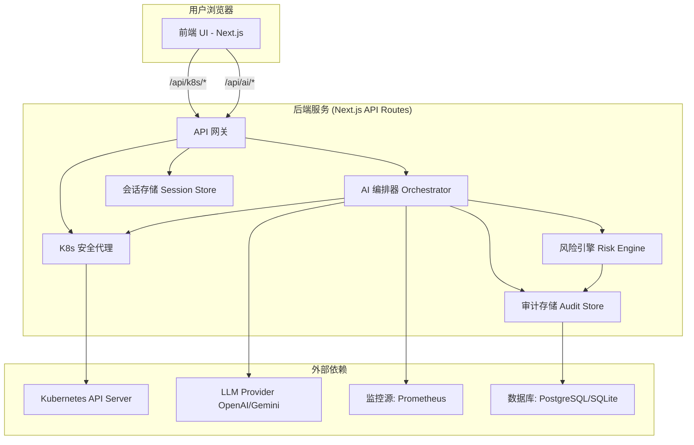

# **0. 项目名称 (Project Name)**

KubeCopilot

# **1. 项目愿景与定位 (Vision & Positioning)**

- **最终愿景 (Ultimate Vision)**: 成为 SRE 和 DevOps 工程师的 AI 原生基础设施层 (AI-Native Infra Layer)。KubeCopilot 通过结构化智能与自然语言接口，让团队以工程化方式治理复杂的 Kubernetes 系统。
- **最终定位 (Positioning)**: 一款 AI 增强的 Kubernetes 智能驾驶舱 (AI-Powered DevOps Cockpit)。传统可视化工具只能展示资源状态，而 KubeCopilot 能理解、解释并生成结构化修复计划，让运维从“看图分析”转变为“对话驱动的决策执行”。

# **2. 指导原则 / 设计哲学 (Guiding Principles)**
- **AI Native (AI 原生)**: AI 不是附属品，而是核心交互和价值的来源。所有功能设计都将优先考虑如何利用 AI 提升效率和降低认知负担。
- **安全默认 (Secure by Default)**: 所有写操作都必须经过 `OperationPlan` 的结构化审查（详见第 8 节）。Kubeconfig 等敏感凭证的处理沿用最高安全标准，后端是唯一与 K8s API 通信的组件。
- **结构化与可审计 (Structured & Auditable)**: AI 的任何输出，特别是写操作建议，都必须是结构化的、可被机器校验的 (Schema-First)。所有变更必须留下清晰、不可篡改的审计日志。
- **Prompt 可重用与可演化 (Prompt as Infra)**: 所有 Prompt 均作为可版本化的资源存在，支持迭代、评估与灰度发布（详见第 9 节）。Prompt 不仅是指令，更是产品行为的一部分。
        Prompt Registry (prompts/manifest.json):Prompt 
        Pipeline：
        所有 AI 请求都必须经过：
        1️⃣ context builder → 2️⃣ prompt template loader → 3️⃣ LLM call → 4️⃣ schema validator → 5️⃣ risk annotator。
        这使得 prompt 行为可追踪、可回滚、可评估。

# **3. SRE 核心思想与实践 (SRE Core Philosophy & Practices)**

本章节旨在将 Google SRE 的最佳实践作为 KubeCopilot 的顶层设计原则，确保我们的产品不仅是一个工具，更是一个帮助团队践行 SRE 文化的智能伙伴。

- **原则一: 消除琐碎工作 (Eliminating Toil)**
    - **SRE 定义**: 琐碎工作是手动、重复、可自动化、无长久价值的工作。SRE 的目标是将其自动化或工程化解决。
    - **KubeCopilot 实现**:
        - **AI 诊断 (Phase 1)**: 将手动的 describe -> logs -> events 排错流程自动化，直接提供结构化洞察，是消除“诊断 Toil”的核心功能。
        - **YAML Copilot (Phase 3)**: 通过 AI 辅助生成、解释和审查 YAML，大幅减少工程师在配置编写上的心智负担和重复劳动。
        - **自然语言交互 (Phase 2)**: 用一句话代替多次点击和命令输入，是消除“操作 Toil”的终极形态。
- **原则二: 拥抱风险与 SLO 驱动决策 (Embracing Risk & SLO-Driven Decisions)**
    - **SRE 定义**: 100% 可靠性不现实。通过定义服务等级目标 (SLO) 和错误预算 (Error Budgets) 来量化可接受的风险，并以此作为发布和变更决策的数据依据。
    - **KubeCopilot 实现**:
        - **OperationPlan & 风险引擎 (Phase 2)**: 这是管理变更风险的基石。所有变更被计划、分级和审查，将模糊的风险变得清晰可控。
        - **SLO/错误预算管理 (Phase 4)**: 在 KubeCopilot 中引入 SLO 定义和错误预算跟踪模块。AI 在生成 OperationPlan 时，会将**当前错误预算的消耗情况**作为风险评估的关键输入，例如：“警告：此变更将耗尽本月剩余错误预算，建议拒绝或在非高峰期执行。Risk Engine 将在 Phase 4 与 SLO 模块深度集成，使 OperationPlan 的风险评估与错误预算挂钩，实现「数据驱动的可靠性决策」。
- **原则三: 安全渐进的自动化 (Safe, Progressive Automation)**
    - **SRE 定义**: 自动化应从辅助手动操作演进到半自动工作流，最终才到全自动系统。信任是逐步建立的。
    - **KubeCopilot 实现**:
        - **清晰的演进路线**: 我们的路线图遵循了这一原则：Phase 1 (AI 辅助洞察) -> Phase 2 (人机确认的工作流) -> Phase 4 (探索半自动修复)，确保了自动化的安全性和可信度。
        - **双重校验**: 任何写操作都需要人类的最终确认，这是在自动化和安全性之间找到的最佳平衡点。
- **原则四: 无指责事后复盘 (Blameless Postmortems)**
    - **SRE 定义**: 从故障中学习是提升系统可靠性的关键。复盘的目的是找到系统性问题并改进，而非追究个人责任。
    - **KubeCopilot 实现**:
        - **AI 辅助事后复盘 (Phase 4)**: 发生事件后，AI 能一键拉取 K8s Events、OperationPlan 审计日志、Prometheus 指标快照，自动生成一份包含**时间线、影响范围、初步根因分析、改进建议**的复盘报告草稿，极大地提升复盘效率和质量。所有故障事件的复盘报告将引用 AI 解释链 (XAI Context)，可追踪 Prompt 版本、模型版本、输入来源与信心水平。这构成了 KubeCopilot 的「Explainability Layer」。
- **原则五: 渐进式部署 (Progressive Rollouts)**
    - **SRE 定义**: 使用金丝雀发布、蓝绿部署等策略来控制变更的“爆炸半径”，是保障服务稳定性的重要手段。
    - **KubeCopilot 实现**:
        - **渐进式发布计划生成 (Phase 4)**: 用户可通过自然语言表达“将服务 X 金丝雀发布 10% 流量”，AI 将自动生成一个包含**部署新版、调整流量、监控 SLI、自动回滚/推进**等步骤的多步 OperationPlan，将复杂的发布流程标准化、安全化。


# **4. 开发工作流 (Development Workflow)**

### **a. 环境管理 (开发 vs. 生产)**

- **方案**: 我们将严格使用**环境变量**来管理不同环境的配置。
- **实现**: Next.js 内置了强大的环境变量支持。
    - .env: 存储所有环境共享的变量（会被提交到 git）。
    - .env.local: 存储本地开发的敏感信息或个性化配置（**不会**被提交到 git）。例如，你可以在这里覆盖 API 地址等。
    - .env.production: 存储生产环境的特定配置。
    - next.config.js: 用于管理构建时的环境变量。
- **原则**: 任何可能在不同环境间变化的配置（如 API 超时、日志级别等）都必须通过环境变量注入，而不是硬编码在代码里。

> **环境配置速览**

| 场景 | 主要文件/变量 | 说明 | 负责人 |
| --- | --- | --- | --- |
| 本地开发 | `.env.local`、`NEXT_PUBLIC_*` | 仅在开发机加载，包含实验性 API、调试开关 | 开发者 |
| 共享默认 | `.env` | 可提交到仓库的公共配置，如默认超时、UI Flag | 架构组 |
| 生产部署 | `.env.production`、平台 Secret Manager | 严禁提交到仓库；由运维注入真实凭证与限流参数 | SRE/平台团队 |
| 构建时常量 | `next.config.js` | 对外公开的静态变量（如版本号、公开文案） | 前端团队 |
| 运行时密钥 | Kubernetes Secret / Vault | LLM Key、数据库连接串，部署后通过环境变量注入 | 平台团队 |

> **流程**：新增配置 → 在 `.env.example` 记录键名 → 说明是否必填及默认值 → 更新部署文档，确保开发/生产同步。

### **b. GitHub 分支管理**

- **方案**: 采用 **GitHub Flow**，这是一个轻量、高效、适合我们项目规模的分支模型。
- **Commit Message 规范**:
    - **格式**: <type>(<scope>): <subject>，例如：
        - feat(api): implement operation plan generation endpoint
        - fix(ui): correct pod status badge color
        - docs(ssot): refine sre principles section
        - test(husky)：增加测试
    - **理由**: 规范化的 Commit Message 能极大地提高 Git Log 的可读性，便于快速理解每次提交的内容。更重要的是，它可以为自动化工具（如 semantic-release）所用，实现**自动化生成 CHANGELOG 和版本号管理**，这是 DevOps 最佳实践的一部分。
- **规则**:
    1. **main 分支**: 这是项目的主分支，永远处于**可部署**状态。不允许直接 push，所有合并必须通过 Pull Request。
    2. **特性分支 (feat Branches)**:
        - 任何新的功能或修复，都必须从 main 分支创建一个新的特性分支。
        - 分支命名规范: feat/login-page, fix/pod-list-bug, refactor/api-client。
    3. **拉取请求 (Pull Request - PR)**:
        - 当特性开发完成后，向 main 分支发起一个 PR。
        - 即使是独立开发，PR 也是一个强制性的步骤。它可以帮助你进行**代码自审 (Self-Review)**，确保代码质量，并为未来可能的自动化检查（CI/CD）留下入口。
- **分支策略 (GitHub Flow)**:
    1. `main` 分支是生产分支，永远保持可部署状态。
        git checkout main
        git pull origin main
    2. 从 `main` 拉取新的 `feat/` 或 `fix/` 分支进行开发。
        git checkout -b feat/***
        git add .
        git commit -m "Add *** feat"
        git push -u origin feat/XXX(git push --set-upstream origin feat/XXX)
    3. 开发完成后，向 `main` 分支发起 Pull Request (PR)。
    4. PR 合并。
        git checkout main
        git pull origin main
    5. 删除已合并的功能分支。
        git branch -d feat/XXX
        git push origin --delete feat/XXX

### **c. 开发环境指南 (Development Environment Guide)**

**核心原则**: 我们的开发环境必须最大限度地模拟生产环境（Linux），以遵循“开发-生产环境对等”的 SRE 最佳实践。

- **操作系统**: **Windows 11/10 + WSL2 (Ubuntu)**。所有开发活动，包括编码、运行命令、版本控制，都必须在 WSL2 的 Ubuntu 环境中进行。这是为了确保环境一致性、最大化性能和工具链兼容性。
- **编辑器/IDE**: 推荐使用支持远程开发的编辑器，如 **VS Code (with WSL Extension)** 或 **Zed**。通过在 WSL2 终端的项目目录中运行 `code .` 或 `zed .` 来启动，以获得最佳的集成体验。
- **核心工具链**: **所有开发工具链 (Node.js, npm, Docker CLI) 都必须独立安装在 WSL2 内部**，推荐使用 `nvm` 管理 Node.js 版本。严禁混用或依赖 Windows 中安装的工具链，以避免“环境污染”导致的路径和兼容性问题。
- **本地 K8s 集群**: 使用 **k3d** 在 WSL2 内部的 Docker 中创建和管理轻量级 K3s 集群。这提供了快速、隔离、可复现的测试环境，完美契合 CI/CD 和自动化测试的需求。
        - 创建开发集群: 使用以下命令创建一个专用于 KubeCopilot 开发的集群：k3d cluster create kubecopilot-dev
        - 获取 Kubeconfig: 要获取用于连接的 Kubeconfig 内容，请运行：k3d kubeconfig get kubecopilot-dev
        - 清理集群: 当不再需要时，可以使用以下命令删除集群以释放资源：k3d cluster delete kubecopilot-dev
- **环境一致性原则 (Principle of Environmental Congruence)**: 开发环境必须与目标生产环境（Linux）保持高度一致。我们坚持在 WSL2 内部进行所有开发，使用原生的 Linux 工具链。这一原则旨在从根源上消除“在我机器上能跑”的问题，确保我们构建的软件健壮、可靠，并符合 DevOps 最佳实践。

### **d. 测试策略 (Testing Strategy)**

我们采纳“测试金字塔”模型，分阶段引入测试。

- **Phase 1 (当前阶段)**: **不引入测试**。此阶段主要为环境搭建和基础 UI 展示，业务逻辑极少。配置 `pre-commit` 钩子运行 `ESLint` 和 `Prettier` 来保证静态代码质量。
- **Phase 2 (引入后端逻辑时)**: **引入单元/集成测试**。当开始开发 `AI 编排器`、`风险引擎` 和 `OperationPlan` 生成等核心后端逻辑时，我们将引入 `Jest` (或 `Vitest`) 作为测试框架。我们将为这些无 UI 的、处理关键数据和逻辑的模块编写详尽的单元测试和集成测试，确保其行为的正确性和稳定性。
- **Phase 3 & Beyond (引入复杂 UI 交互时)**: **引入前端测试**。当开发如 `YAML Copilot`、`SLO 定义` 等包含复杂状态和用户交互的组件时，我们将引入 `React Testing Library` 和 `Jest-DOM` 来进行组件级别的单元和集成测试，确保前端行为符合预期。
- **未来 (CI/CD 流水线成熟时)**: **引入端到端 (E2E) 测试**。我们将使用 `Playwright` 或 `Cypress`，在 CI 流程中针对 k3d 创建的临时集群，运行关键用户流程的自动化测试（如：连接集群 -> 通过自然语言伸缩 Deployment -> 验证结果）。

### **f. 凭证与安全流程 (Credential Handling Flow)**

| 步骤 | 描述 | 工具/存储 | 责任人 |
| --- | --- | --- | --- |
| 1. 前端提交 | `/connect` 页面通过 HTTPS 将原始 Kubeconfig POST 至 `/api/k8s/connect`，前端不持久化 | Next.js App Router | 前端 |
| 2. 服务端校验 | `lib/k8s/connection.ts` 校验权限边界，拒绝越权 ClusterRole | @kubernetes/client-node | 平台团队 |
| 3. 会话封装 | 通过 `iron-session` 加密存储（短期）或外部 Secret Store（中长期） | iron-session / Redis / Vault | 平台团队 |
| 4. 请求代理 | 所有 `/api/k8s/*` 调用仅从安全代理获取凭证，前端绝不直连 K8s API | Secure Proxy | 后端 |
| 5. 失效清理 | 会话到期或用户断开时销毁缓存，必要时吊销临时凭证 | Middleware、后台任务 | 平台团队 |

> **注意**：所有写操作仍需通过 `OperationPlan` 审批（第 8 节），确保凭证与变更路径均处于受控状态。

**测试技术栈**:
- **测试运行器**: `Jest` 或 `Vitest`
- **前端组件测试**: `React Testing Library`
- **端到端测试**: `Playwright` (推荐) 或 `Cypress`

### **g. 前端 UI 迭代策略 (Frontend UI Iteration Strategy)**

- **核心原则**: 为践行“开发者体验至上 (DX First)”并允许未来对 UI 进行持续打磨，我们采用**“逻辑与视图分离”**的组件设计策略。
- **实施方案**:
    - **逻辑层 (Logic Layer)**: 指的是组件内的 React Hooks (`useState`, `useEffect`), 状态管理 (`Zustand`) 以及事件处理函数 (`handleConnect` 等)。这是组件的“大脑”，负责状态管理和业务流程，应保持稳定。
    - **视图层 (View Layer)**: 指的是组件 `return()` 语句中的 JSX 结构，由 `shadcn/ui` 或其他 UI 元素构成。这是组件的“皮肤”，可以被灵活替换和美化。
- **迭代工作流**:
    1.  **设计**: 使用 Figma, Stitch 等工具设计新的 UI 界面。
    2.  **开发**: 编写或生成新的视图层 (JSX) 代码。
    3.  **替换**: 在对应的组件文件中，**仅替换 `return()` 内的 JSX 部分**，保留顶部的逻辑层代码。
    4.  **重绑**: 将逻辑层中的状态和事件处理器（如 `value`, `onChange`, `onClick`）重新绑定到新的 JSX 元素上。
- **优势**: 此策略确保了我们可以低风险、高效率地对产品 UI 进行迭代和优化，而无需重写已经稳定的核心业务逻辑。

# **5. 技术栈 (Tech Stack)**

- **核心框架**: Next.js 14 (App Router), TypeScript
    - *理由*: 全栈能力，统一前后端开发体验，完美契合我们“前端 UI + 后端安全代理/AI 编排器”的架构。
- **UI 框架**: Tailwind CSS, shadcn/ui, Magic UI
    - *理由*: 高度可定制的原子化 CSS，结合预制、符合无障碍标准的优美组件，能极大地提升开发效率和 UI 质量。
- **状态管理**: Zustand
    - *理由*: 轻量、简洁、无模板代码。对于需要跨组件共享的状态（如当前选择的 Namespace、集群连接状态），它是最理想的选择。
- **后端核心**:
    - **K8s 客户端**: @kubernetes/client-node
        - *理由*: CNCF 官方 Node.js 客户端，是与 Kubernetes API Server 通信的标准和最可靠的方式。
    - **数据库 ORM**: Prisma
        - *理由*: 提供类型安全的数据库访问，简化数据库迁移和查询。能与 PostgreSQL (生产) 和 SQLite (本地开发) 无缝协作，是 Audit Store 和 OperationPlan 持久化的最佳选择。
    - **数据库**: PostgreSQL (生产推荐), SQLite (本地开发)
        - *理由*: PostgreSQL 功能强大、稳定可靠；SQLite 轻量零配置，非常适合本地快速启动和测试。
- **AI 与数据校验**:
    - **LLM 客户端**: openai 或 @google/generative-ai
        - *理由*: 用于与大语言模型 API（如 OpenAI GPT 系列或 Google Gemini 系列）进行交互。
        - **AI 客户端抽象层**: 我们将 AI 客户端实现为一个可插拔的模块，通过配置文件指定使用的模型（如 OpenAI、Google Gemini、Ollama 等）。这使得我们可以在不改变核心业务逻辑的情况下，轻松切换不同的 AI 模型。
    - **Schema 校验**: Zod
        - *理由*: **AI Native 架构的基石**。用于在后端严格校验 LLM 返回的 JSON 是否符合我们定义的 OperationPlan 等 Schema，确保 AI 输出的可靠性和安全性。
- **编辑器与可视化**:
    - **YAML 编辑器**: @monaco-editor/react
        - *理由*: VS Code 的核心编辑器，提供一流的 YAML 编辑、语法高亮和校验体验，是 YAML Copilot 功能的不二之选。
    - **数据图表**: Recharts
        - *理由*: 简单、组件化的图表库，非常适合未来集成 Prometheus 指标，展示 CPU/内存等监控图表。
- **代码质量**: ESLint, Prettier, Husky
    - *理由*: 保证代码风格统一、质量可靠的行业标准三件套。
- **认证与会话管理库**:
    - jsonwebtoken 和 bcryptjs。
    - **理由**: 在“集群连接 & 基础布局”中，我们需要安全地管理用户会话。jsonwebtoken (JWT) 是实现无状态认证的行业标准，可以用来签发一个有时效性的 token，证明用户已成功连接。即便我们初期仅将会话信息存在内存中，使用 JWT 也是一个更规范、更安全的实践。bcryptjs 则是在我们未来可能支持用户名/密码登录时，用于密码哈希的标准库，提前纳入考量体现了我们的安全前瞻性。
- **日志库**:
    - pino 或 winston。
    - **理由**: 一个好的后端服务必须有结构化的日志。pino 以其极高的性能和 JSON 结构化日志输出而著称，非常适合在 API 路由中记录请求、AI 操作、错误等信息，便于未来的日志分析和告警。
- **部署与运行环境**:
    - Docker + Kubernetes (自部署)
    - Helm Chart 用于打包与发布
---

# **6. 项目结构 (Project Structure)**

## **6.1 规划的项目结构 — 面向模块化生长 (Composable Growth)**

> 目标：保持当前单体（Next.js App Router + Edge Functions）高效迭代，同时为未来拆分成多个微服务 / 独立工作负载预埋边界。核心策略是“先模块化，再服务化”。

```
kubecopilot/
├── apps/                          # 运行时入口层，可扩展到多个前后端应用
│   └── console/                   # (现状) Next.js 单体；未来可抽象为前端独立应用
│       ├── app/                   # App Router：UI、路由、适配层
│       ├── middleware.ts          # 前端侧会话 / feature flag
│       └── public/                # 静态资源
├── services/                      # 面向微服务的运行时单元（Phase 2+）
│   ├── core-api/                  # K8s 读写、会话、权限；可迁移到独立 Node/Go 服务
│   ├── ai-orchestrator/           # Prompt registry、LLM pipeline、评估任务
│   └── audit-ledger/              # OperationPlan、审计日志、事件回放
├── packages/                      # 可被 apps/services 复用的领域包（支持 npm workspace）
│   ├── domain-k8s/                # Kubernetes DTO、用例、策略；已从 `src/lib/k8s/**` 迁入
│   ├── domain-ai/                 # Prompt schema、AI 风险模型；已从 `src/lib/ai/**` 迁入
│   ├── infra-http/                # fetch/node-fetch 封装、错误协议；已从 `src/lib/api/**` 迁入
│   ├── ui-kit/                    # 设计体系组件；已从 `src/components/ui/**` 迁入
│   └── telemetry/                 # 监控、审计、日志统一 SDK（待建设）
├── prisma/                        # 数据访问层；迁移时可被 core-api 重用
├── prompts/                       # Prompt Registry（版本化资源）
├── patches/                       # 对第三方依赖的 patch-package (确保 deterministic build)
├── scripts/                       # 本地脚本（如 prompt manifest 校验）
├── src/lib/operation-plan         # Risk Engine、Plan 服务、审计持久化
├── src/lib/prisma.ts              # Prisma client 单例
├── src/lib/telemetry              # API 请求日志包装器等观测辅助
├── SSOT.md / README.md            # 架构 & 团队对齐文档
└── package.json / pnpm-workspace.yaml (未来) / turbo.json (未来)
```

**演进路径**

1. **Phase A（已完成）**：保留 `apps/console` 单体形态，持续在 `packages/` 思维下划分目录（即便物理仍在 `src/lib/**`，也要遵循包边界约束：禁止“跨领域”导入内部实现）。
2. **Phase B（边界固化，进行中）**：已经引入 npm workspace，并把 `src/lib/k8s/*`、`src/lib/ai/*` 等迁入 `packages/`；同时在 `services/` 下创建占位（stub）服务，复用同一套 domain 包，后续将补齐 lint/CI 守护与 barrel export。
3. **Phase C（服务化拆分）**：当某一领域需要独立扩容或安全隔离（如 `ai-orchestrator` 访问外部 LLM），将其迁到独立部署单元，只需替换 `apps/console` 中的 API 网关地址，domain 包和 DTO 保持不变，实现“无痛拆分”。

通过上述规划，团队可以在保持交付速度的同时，逐步获得清晰的领域界限、可组合的包，以及天然支持微服务/多运行时的架构骨架。


## **6.2 当前的项目结构 (Current Project Structure)**

- `src/app/(dashboard)`：按资源域划分页面（pods/deployments/...）；App Router 的服务器组件负责拉取数据并拼装 UI，`layout.tsx` 统一壳层，`events/` 页面提供全局事件时间线。
- `src/app/api`：  
  - `api/k8s/**/[[...path]]/route.ts` 为各资源提供统一入口（列表、详情、events、搜索），路由层只解析参数，业务交由 `packages/domain-k8s`。  
  - `api/ai/diagnose` 等目录承载 AI 调用代理，复用 `packages/domain-ai` 的 prompt pipeline。  
  - `api/k8s/search` 提供跨资源搜索/聚合。
- `src/components/k8s`：以资源为单位拆分 UI 组件，`shared/` 下的 `EventsTable.tsx`、`ReadOnlyYamlViewer.tsx`、`ResourceDetailPage.tsx`、`ResourceTable.tsx` 提供一致的详情体验；`k8s/**` 内的卡片、表格消费 typed DTO。
- `packages/ui-kit` & `src/components/layout`：封装 UI 基础组件（基于 shadcn/ui）与全局导航、搜索栏等布局元素。
- `src/hooks/useK8sResource.ts`：集中处理 SWR 数据流、轮询、状态管理，为 Dashboard 页面提供统一的数据获取体验。
- `src/lib`：  
  - `lib/k8s/services` / `transformers` / `types` / `utils`：Kubernetes 领域逻辑；`connection.ts` 与 `client.ts` 负责 kubeconfig、API client 生命周期。  
  - `lib/api`：HTTP 响应包装、错误类型、验证。  
  - `lib/ai`：Prompt schema、LLM 请求封装（与 `prompts/` 的 manifest 对齐）。  
  - `lib/formatters`：跨模块复用的展示格式化函数。
- `prisma/`：数据模型定义；`src/generated/prisma` 为自动生成的 Prisma Client（只读）。
- `prompts/`：LLM 提示语模板与 manifest；`patches/` 存放 `patch-package` 生成的依赖补丁，保证构建一致性。
- 其他：`AGENTS.md` / `GEMINI.md` 等说明文档，`eslint.config.mjs` / `postcss.config.mjs` / `tailwind` 配置支撑工程化标准。

### **6.2.1 导航架构 V1 (Navigation Architecture V1)**

V1 版本的导航结构反映了项目早期的功能布局，主要以 AI 功能和扁平化的资源列表为核心。

- **Operations (操作)**
  - `Operation Plans`: 查看和管理由 AI 生成或用户创建的操作计划。
  - `YAML Copilot`: 使用 AI 辅助编写和审查 Kubernetes YAML 配置。
- **Observability (可观测性)**
  - `Overview`: 集群的全局概览。
  - `Pods`: 查看 Pods 列表。
  - `Deployments`: 查看 Deployments 列表。
  - `StatefulSets`: 查看 StatefulSets 列表。
  - `DaemonSets`: 查看 DaemonSets 列表。
  - `Jobs`: 查看 Jobs 列表。
  - `CronJobs`: 查看 CronJobs 列表。
  - `ConfigMaps`: 查看 ConfigMaps 列表。
  - `Secrets`: 查看 Secrets 列表。
  - `PVCs`: 查看 PersistentVolumeClaims 列表。
  - `PVs`: 查看 PersistentVolumes 列表。
  - `Ingresses`: 查看 Ingresses 列表。
  - `Events`: 查看集群事件。
  - `Nodes`: 查看集群节点列表。
  - `Services`: 查看 Services 列表。
  - `Namespaces`: 查看 Namespaces 列表。

### **6.2.2 导航架构 V2 (Navigation Architecture V2)**

V2 是面向 SRE 排障闭环的 IA，核心目标是：AI 能力置顶、导航顺序贴合真实 troubleshooting path，同时保留传统资源树作为辅助工具。该结构通过 `NEXT_PUBLIC_ENABLE_NAV_V2` feature flag 控制：生产默认为 `false`（V1），本地开发可在 `.env.local` 中设置 `NEXT_PUBLIC_ENABLE_NAV_V2=true` 体验 V2。需要回退/切换时，只需调整同名环境变量并重新启动 Next.js。

- **AI Copilot（助理驾驶舱）**
  - *定位*: 所有“以 AI 交互为中心”的工作流集中在这里，用户进入时的心智是“我来让 AI 帮我做事”，而非浏览资源。
  - *典型能力*: `Ask the Cluster`（自然语言问诊）、`YAML Copilot`（生成/校验 YAML）、`Operation Plans`（AI 生成操作方案）。
  - *体验特征*: 入口是输入框/表单/向导，主要输出结构化的 AI 结论（分析-计划-建议），可跨 namespace/资源串联上下文，强调人机协作（AI 提案 + 人审阅执行）。
  - *不做*: 不承担完整资源浏览、图表展示，这些交给 Resources 与 Dashboards。
- **SRE Mission Control（排障任务流）**
  - *定位*: 给 Oncall/SRE 排障用的“驾驶舱”，核心问题是“哪里不健康？我要怎么排查？”，而不是 CRUD UI。
  - *分组*: `Health`（总览、Events、AI Diagnosis）、`App Runtime`（Pods/Deployments/...）、`Platform`（ConfigMaps/Secrets/...）、`Infra`（Nodes/Namespaces）。
  - *体验特征*: 资源按异常优先级排序，支持按“过去 30 分钟重启 >3 次”这类聚合，配 AI 解释/建议。
  - *不做*: 不追求字段完整性，不做资源级 CRUD；那是 Resources 的职责。
- **Dashboards（仪表盘）**
  - *定位*: “读数 + 趋势 + TopN” 的可视化态势视图，回答“整体情况如何”。
  - *典型页面*: `Overview`、`Node/Workload/Network/Storage Dashboard`，以卡片/图表展示资源健康、延迟、流量、容量趋势，可跳入 Mission Control/Resources 深挖。
  - *不做*: 不提供精细操作或完整 Detail，纯只读。
- **Resources（K8s 工具箱）** — 三级树结构，覆盖所有既有资源：
  - *定位*: 对标 `kubectl get/describe` 的“中立、完整”资源浏览器，为专业用户提供全部字段/YAML/Events。
  - `Workloads` → Pods / Deployments / StatefulSets / DaemonSets / Jobs / CronJobs
  - `Networking` → Services / Ingresses
  - `Config & Storage` → ConfigMaps / Secrets / PVCs / PVs
  - `Cluster` → Nodes / Namespaces
  - *体验特征*: `/resources/<kind>` 采用优化的两栏布局：桌面端左列是带工具栏的表格（过滤器收敛到 toolbar、列表在限定高度内滚动），右列为可折叠/可调整宽度的 Inspector（内容用响应式卡片网格 + 粘性 tabs 呈现 Summary/Spec/Status/Events/YAML）；移动端 Inspector 以 Drawer + Accordion 呈现，避免过长滚动。
  - *区别*: 与 Mission Control 的“问题优先”不同，这里是“资源优先”。
- **Audit（审计 & 操作记录）**
  - *定位*: 记录“谁在什么时候、为何对集群做了什么”，是 AI+人类运维行为的账本。
  - `Operation History` (`/audit/operations`)：展示每条 Operation Plan 的生成/执行/结果。
  - `Audit Events` (`/audit/events`)：关键操作事件（删除资源、扩缩容等）。
  - `API Logs` (`/audit/api-logs`)：后端调用 K8s API 的日志。
  - *字段*: `time`、`actor`、`action`、`resources affected`、`source`（来自 AI/Mission Control/手工）、`status`、`reason/comment`。
  - *体验特征*: 时间线/表格视图，强调过滤、审计、追责，不提供直接操作。

> **占位路由策略**
> 
> 为避免导航链接 404，所有 V2 新增入口都必须先创建 Next.js 页面（返回 `<div>🚧 Coming Soon</div>`）。对应目录：
> - `src/app/ask-cluster/page.tsx`
> - `src/app/ai-diagnosis/page.tsx`
> - `src/app/dashboards/{cluster,workloads,network,storage}/page.tsx`
> - `src/app/audit/{operations,api-logs,events}/page.tsx`
>
> 后续实现功能时直接替换页面内容，无需改导航配置。

> **未来扩展**
> 
> Network Policies、Storage Classes、CRDs 等仍在规划中，只在 SSOT 中记录，不在 V2 UI 中出现，以免产生“功能不可用 / 权限被禁”误解。发布相应页面后再追加到 `navConfigV2`.


# **7. 核心架构 (Core Architecture)**



- **前端 (Frontend)**: 纯 UI 层，负责用户交互，包括**命令面板 (Prompt Bar)** 和资源的可视化展示。
- **K8s 安全代理 (Secure Proxy)**: 后端中唯一与 K8s API Server 通信的模块。负责处理所有 `kubectl` 风格的请求。
- **AI 编排器 (AI Orchestrator)**: 核心大脑。接收来自前端的自然语言或操作意图，调用 LLM 生成结构化数据（如诊断、`OperationPlan`），并与风险引擎和审计模块交互。
- **风险引擎 (Risk Engine)**: 根据预设规则和 AI 评分，为 `OperationPlan` 评定风险等级，并决定是否需要人工确认。
- **审计存储 (Audit Store)**: 记录所有重要操作，尤其是 AI 生成的计划和用户的确认行为，提供不可篡改的追溯依据。
- **[未来考量]**: 为支持未来的高可用部署，会话存储需要从内存模式平滑升级到外部共享存储模式（如 Redis）。

> **职责矩阵**

| 模块 | 主要职责 | 当前实现 | 可独立部署 | 关键依赖 |
| --- | --- | --- | --- | --- |
| 前端 Console | UI、命令面板、PlanConfirmModal、可视化 | Next.js App Router | ✅（Phase 3 以后） | `packages/ui-kit`、API 网关 |
| K8s Secure Proxy | 转发 REST/gRPC、凭证校验、资源聚合 | Next.js Route Handler / `services/core-api` 预留 | ✅ | Kubernetes API Server、Prisma |
| AI Orchestrator | Prompt Registry、LLM 调用、RiskAnnotator | Next.js Route Handler / `services/ai-orchestrator` 预留 | ✅ | LLM Provider、Prompt Manifest |
| Risk Engine | 计划风险打分、错误预算策略 | `packages/domain-ai`（Phase 2 简化规则） | ✅ | OperationPlan 审计库、SLO 模块 |
| Audit Ledger | OperationPlan 生命周期、执行审计 | Prisma（PostgreSQL/SQLite） | ⚠️（需共享数据库） | 数据库、身份体系 |
| Telemetry 层 | 请求日志、metrics、tracing | 待引入 `packages/telemetry` | ✅ | OpenTelemetry、日志管线 |

# 8. 核心数据结构:OperationPlan

这是连接 AI 与 Kubernetes 的核心契约，**是本项目最重要的抽象**。所有写操作都必须先被封装成一个OperationPlan。
关键结构与解释逻辑
    Pre-Execution Check：执行前再次比对 diff.before 与当前资源状态，防止状态漂移。
    Action Whitelist：AI 仅可在白名单内生成 Plan。
    Schema Versioning：OperationPlan 的 Zod Schema 需带版本号，确保升级时兼容性。
    三层可视化模型：
        层 1：自然语言摘要
        层 2：结构化 Patch 列表
        层 3：Side-by-Side YAML Diff (默认折叠)

**Schema (Zod 定义):**

```typescript
import { z } from 'zod';

// RFC 6902 JSON Patch object schema
const jsonPatchSchema = z.array(
  z.object({
    op: z.enum(['add', 'remove', 'replace']),
    path: z.string(),
    value: z.any().optional(),
  })
);

export const OperationPlanSchema = z.object({
  id: z.string().uuid(),
  version: z.string().default('1'),
  status: z.enum(['pending', 'confirmed', 'executed', 'failed', 'reverted']),
  action: z.enum(['create', 'update', 'delete', 'scale', 'restart']),
  steps: z
    .array(
      z.object({
        id: z.string(),
        action: z.enum(['create', 'update', 'delete', 'scale', 'restart']),
        description: z.string(),
        patch: jsonPatchSchema.optional(),
        rollbackPatch: jsonPatchSchema.optional(),
      }),
    )
    .default([]),
  resource: z.object({
    kind: z.string(),
    namespace: z.string(),
    name: z.string(),
    uid: z.string().optional(),
    resourceVersion: z.string().optional(),
  }),
  diff: z.object({
    // 用于执行前终态检查和 UI 深度对比的完整资源快照
    before: z.record(z.string(), z.any()).nullable(),
    // 用于高效存储和清晰展示变更核心的 JSON Patch
    patch: jsonPatchSchema,
    patchFormat: z.enum(['rfc6902', 'strategic-merge']).default('rfc6902'),
    rollbackPatch: jsonPatchSchema.optional(),
  }),
  risk: z.object({
    level: z.enum(['low', 'medium', 'high']),
    rationale: z.string(), // AI/规则给出的风险评估理由
    score: z.number().min(0).max(1).nullable(),
    factors: z.array(z.string()).default([]),
    sloBudgetImpact: z.enum(['none', 'low', 'medium', 'high']).optional(),
    postConditions: z.array(z.string()).default([]),
  }),
  aiRationale: z.string(), // AI 解释为什么要做这个操作
  audit: z.object({
    requestedBy: z.string(), // 'user:alice' or 'ai:anomaly-detector'
    confirmedBy: z.string().nullable(),
    executedBy: z.string(),
    idempotencyKey: z.string().optional(),
    sourcePromptId: z.string().optional(),
    timestamps: z.object({
      createdAt: z.date(),
      confirmedAt: z.date().nullable(),
      executedAt: z.date().nullable(),
      failedAt: z.date().nullable(),
      revertedAt: z.date().nullable(),
    }),
  }),
});
```

**示例：Deployment 重启计划**

```json
{
  "id": "8f4f3b3d-1c0d-4f0c-9f6f-2d0c4c0b5c1a",
  "version": "1",
  "status": "pending",
  "action": "restart",
  "steps": [
    {
      "id": "step-1",
      "action": "update",
      "description": "Annotate deployment to trigger rollout",
      "patch": [
        { "op": "add", "path": "/spec/template/metadata/annotations/restart.kubecopilot.io~1ts", "value": "2025-01-12T06:20:00Z" }
      ],
      "rollbackPatch": [
        { "op": "remove", "path": "/spec/template/metadata/annotations/restart.kubecopilot.io~1ts" }
      ]
    }
  ],
  "resource": {
    "kind": "Deployment",
    "namespace": "payments",
    "name": "billing-api",
    "uid": "c0327b2f-2b63-4c50-9b1b-95cb5b0b0d5f",
    "resourceVersion": "123456"
  },
  "diff": {
    "before": { "...": "omitted for brevity" },
    "patch": [
      { "op": "add", "path": "/spec/template/metadata/annotations/restart.kubecopilot.io~1ts", "value": "2025-01-12T06:20:00Z" }
    ],
    "patchFormat": "rfc6902",
    "rollbackPatch": [
      { "op": "remove", "path": "/spec/template/metadata/annotations/restart.kubecopilot.io~1ts" }
    ]
  },
  "risk": {
    "level": "medium",
    "rationale": "Rolling restart of production workload",
    "score": 0.42,
    "factors": ["traffic_spike_window"],
    "sloBudgetImpact": "medium",
    "postConditions": ["All pods reach Ready state within 5 minutes"]
  },
  "aiRationale": "Deployment pods are stuck in CrashLoopBackOff; restart to refresh configuration.",
  "audit": {
    "requestedBy": "user:alice",
    "confirmedBy": null,
    "executedBy": "system",
    "idempotencyKey": "plan-billing-api-restart-20250112",
    "sourcePromptId": "diagnose-pod@1.1.0",
    "timestamps": {
      "createdAt": "2025-01-12T06:19:55.000Z",
      "confirmedAt": null,
      "executedAt": null,
      "failedAt": null,
      "revertedAt": null
    }
  }
}
```
- **核心挑战 1**: 从机器语言到人类直觉 (Core Challenge: From Machine Language to Human Intuition)
    - **问题**: OperationPlan 内部采用 JSON Patch 格式来高效存储变更，但这对于人类用户是难以直接阅读的。为了在 PlanConfirmModal 中提供直观、无歧义的变更审查体验，我们必须将机器友好的数据结构翻译成人类友好的可视化界面。
    - **解决方案**: 分层可视化策略 (Layered Visualization Strategy)
- **核心挑战 2**: 变更审查的透明度和可解释性 (Core Challenge: Transparency and Interpretability of Change Reviews)
    - **问题**: 虽然 OperationPlan 提供了详细的变更记录，但直接展示 JSON Patch 对非技术用户来说是非常抽象和不直观的。
    - **解决方案**: 我们将采用一个三层递进的信息展示模型，以满足不同用户的审查深度需求：
        - **第一层**：人类可读的摘要 (Human-Readable Summary): 在模态框顶部用自然语言清晰总结核心操作 (例如: "将 Deployment 'my-app' 的副本数变更为 5")。这是所有用户第一眼看到的信息。
        - **第二层**：结构化变更列表 (Structured Change List): 一个简洁的表格，逐项列出所有变更的路径 (path) 和新值 (value)，供技术用户快速浏览细节。
        - **第三层**：完整的并排差异视图 (Full Side-by-Side Diff View): 默认折叠的、类似 GitHub PR 的高亮 YAML 差异对比。它通过在前端将 diff.patch 应用于 diff.before 对象来动态生成“之后”的状态，为高风险操作提供最高级别的审查能力。

- **补充说明 1**: OperationPlan 生成与 diff.before 填充时机
    - diff.before 字段必须在**生成 OperationPlan 的那一刻**，通过向 K8s API Server 查询资源的**当前状态**来填充。diff.after 则是根据用户意图和当前状态计算出的**期望状态**。
    - 时间戳字段为“审计”和“事后复盘”提供了精确到毫秒的关键证据链。我们可以清晰地知道一个计划从被创建、被确认到被执行分别花费了多长时间。
    - **理由**: 这强调了一个关键的实现细节。如果不在生成计划时就固定 before 状态，那么从计划生成到用户确认的这段时间内，资源的真实状态可能又发生了变化，这会导致执行结果与预期不符。固定 diff 快照是保证操作确定性的重要一环。
- **补充说明 2**: OperationPlan 执行前终态检查
    - **Pre-Execution Check (执行前终态检查)**: 在执行 /api/ai/execute 时，系统必须在执行操作前，重新从 K8s API 获取资源的当前状态，并与 OperationPlan.diff.before 快照进行对比。若不一致，必须中止操作并向用户报告。
    - **Action Whitelist (操作白名单)**: AI 编排器在生成 OperationPlan 后，必须根据一个硬编码的 (action, resource.kind) 白名单进行校验。例如，初期白名单可能只包含 ('restart', 'Deployment'), ('scale', 'Deployment')。任何不在白名单内的计划都将被拒绝。
    - **理由**: 这两条原则是“安全默认”设计哲学的具体代码实现，能从根本上杜绝状态漂移和 AI “越权”操作带来的风险，是我们构建可信赖写操作的基石。
- **补充说明 3**: 多步骤计划与回滚准备
    - 当 `steps[]` 非空时，每个步骤需绑定可选 `rollbackPatch`，执行器在失败时按照逆序套用，保证“可恢复”能力。
    - `idempotencyKey` 使执行端可以安全重试，`sourcePromptId` 将 OperationPlan 与 Prompt Registry 的条目串联，方便追溯 AI 决策来源。
    - 执行前除了对比 `diff.before`，还需要校验 `resource.resourceVersion` 是否与 K8s 当前值匹配，确保不会覆盖外部更新。

- **OperationPlan 差异可视化**：从机器语言到人类直觉 (Diff Visualization: From Machine Language to Human Intuition)
    - **核心挑战**: OperationPlan 内部采用 JSON Patch 格式高效存储变更，但这对于人类用户是难以阅读的。为了在 PlanConfirmModal 中提供直观、无歧义的变更审查体验，我们必须将机器友好的数据结构翻译成人类友好的可视化界面。
    - **解决方案**: 分层展示策略 (Layered Display Strategy)
        我们将采用一个三层递进的信息展示模型，以满足不同用户的审查深度需求：
        - **第一层**：人类可读的摘要 (Human-Readable Summary)
        目标用户: 所有用户。
        形式: 在模态框顶部用自然语言清晰总结核心操作。
        实现: 后端或前端将 JSON Patch 数组映射为简洁的描述性文本。
        示例:
        JSON Patch: [{ "op": "replace", "path": "/spec/replicas", "value": 5 }]
        UI 显示: "将 Deployment 'my-app' 的副本数 (replicas) 变更为 5"
        - **第二层**：结构化变更列表 (Structured Change List)
        目标用户: 技术用户，需要快速浏览变更细节。
        形式: 一个简洁的表格，逐项列出所有变更的路径和新值。
        实现: 直接遍历 JSON Patch 数组并格式化输出。
        UI 显示:
        | 操作 | 目标路径 | 新值 |
        | :--- | :--- | :--- |
        | replace | /spec/replicas | 5 |
        - **第三层**：完整的并排差异视图 (Full Side-by-Side Diff View)
        目标用户: 高级用户或在进行高风险操作时，需要进行深度代码级审查。
        形式: 类似 GitHub PR 的、高亮的、并排 YAML 差异对比。
    实现: 此视图默认折叠。点击展开后，前端将使用 OperationPlan 中缓存的 before 状态，并动态应用 JSON Patch 来生成 after 状态，然后使用 react-diff-viewer 等库进行渲染。
    战略价值: 此策略完美践行了“开发者体验至上”的原则。它通过信息分层，既为快速、低风险的操作提供了流畅的确认流程，也为复杂、高风险的变更提供了最高级别的安全审查能力，在效率和严谨之间取得了最佳平衡。

# 9. 核心数据结构： Prompt Registry & Schema Governance

为落地 “Prompt as Infra”，新增 Prompt Registry
```json
[
  {
    "id": "diagnose-pod",
    "version": "1.1.0",
    "schemaRef": "ai-diagnosis.zod.ts",
    "lastEvaluated": "2025-10-15",
    "approved": true,
    "model": "gpt-4.2",
    "temperature": 0.2,
    "maxTokens": 1200,
    "envAllowlist": ["prod", "staging"],
    "riskTier": "low",
    "category": "diagnostics",
    "owner": "ai-platform",
    "reviewedBy": ["sre-lead", "ml-safety"],
    "changelog": [
      {
        "version": "1.1.0",
        "date": "2025-10-15",
        "notes": "Improved node pressure hints"
      }
    ],
    "evaluationMetrics": {
      "accuracy": 0.87,
      "coverage": 0.92,
      "lastRun": "2025-10-12"
    },
    "inputSchemaRef": "diagnose-pod.input.zod.ts",
    "outputSchemaRef": "diagnose-pod.output.zod.ts",
    "rollout": {
      "strategy": "percentage",
      "stages": [
        { "percent": 10, "conditions": ["staging-only"] },
        { "percent": 50, "conditions": ["errorRate < 5%"] },
        { "percent": 100, "conditions": ["manual-approval"] }
      ]
    }
  }
]
```

Prompt Pipeline

所有 AI 请求必须经过统一管线：
```json
contextBuilder → promptLoader → LLM call → ZodValidator → RiskAnnotator
```
收益：Prompt 可治理、可追溯、可灰度发布，为未来商业版打基础。

- **治理补充**：  
  - `inputSchemaRef` / `outputSchemaRef` 确保上下游以同一契约交互，Zod 校验失败时需触发 fallback prompt 或中止执行并上报。  
  - `evaluationMetrics` 与 `rollout` 字段使我们可以记录离线测评结果、逐步扩大覆盖面，并结合 `envAllowlist` 控制不同环境的启用策略。  
  - `owner`、`reviewedBy`、`changelog` 构成完整的 Prompt 审批链；任何改动必须通过 Registry 提交，执行器基于 `riskTier` 与 `model` 选择对应的安全策略。  
  - RiskAnnotator 可依据 `riskTier`、最近指标自动调高人类审核阈值，例如高风险 Prompt 默认要求 OperationPlan 再经过人工确认。
  - `npm run validate:prompts` 校验清单，执行 Zod 模式与模板文件存在性检查，为 CI 提供快速守门。

> **发布流程**
>
> 1. **草稿**：维护者更新 `prompts/manifest.json` 与对应模板，提交 PR。  
> 2. **自动验证**：CI 运行 manifest 校验脚本，检查 schema 引用、灰度配置、评估指标是否填写。  
> 3. **人工审核**：`owner` 指派评审（SRE/AI 审核）确认风险、合规性，必要时补充评估报告。  
> 4. **灰度发布**：根据 `rollout.strategy` 逐步扩大覆盖，监控 `evaluationMetrics`。  
> 5. **正式上线**：满足退出条件后，将 `approved` 标记为 true 并记录 `changelog`。若指标恶化则回滚至前一版本或启用 fallback prompt。


# **10. 开发路线图 (Revised Roadmap)**

这是最重要的部分。我们将宏大的愿景分解为更务实、更聚焦的四个阶段。

---

## **Phase 1: 基础架构与 AI 只读洞察 (Foundation & Read-Only AI Insights)**

*目标：搭建项目骨架，实现集群连接，并**首次展示 AI 的“解释”能力**，让用户立刻感受到价值，但没有任何风险。*

- [x]  **环境搭建**:
    - [x]  搭建了现代化、全栈的技术栈:
        - [x]  项目初始化: 使用 Next.js 14 (App Router), TypeScript, Tailwind CSS 和 shadcn/ui 创建了项目骨架。
        - [x]  依赖集成: 安装了所有核心依赖，包括 @kubernetes/client-node 用于 K8s 通信，Prisma 用于数据库交互，Zod 用于 AI 输出校验。
    - [x]  建立了自动化的代码质量保障体系:
        - [x]  工具链: 配置了 ESLint, Prettier, Husky 和 lint-staged。
        - [x]  工作流: 实现了在每次 git commit 时，通过 pre-commit 钩子自动对代码进行格式化和静态检查，确保了代码库的长期整洁与规范。
        - [x]  排错与完善: 解决了 pre-commit 钩子的默认行为问题，并据此明确了项目的分阶段测试策略。
    - [x]  **完成了项目版本控制的初始化**:
        - [x]  成功将项目初始化为 Git 仓库。
        - [x]  完成了首次提交，并将项目推送到了远程仓库。
- [x]  **集群连接 & 基础布局**:
    - [x]  任务 1: 创建 /connect 连接页面:
        - [x]  UI 开发: 使用 shadcn/ui 组件（如 Card, Label, Textarea, Button）构建一个简洁的 UI 界面。一个大的文本域（Textarea），用于让用户粘贴他们的 Kubeconfig YAML 内容。一个“连接”按钮。
        - [ ]  UI 增强: 增加文件上传按钮，在前端解析文件内容并填充到文本域。
        - [ ]  （可选）提供一些提示信息，说明如何获取 Kubeconfig。
        - [x]  状态管理: 使用 Zustand 或 useState 来管理文本域中的 Kubeconfig 内容。
    - [x]  任务 2: 实现后端连接 API (/api/k8s/connect):
        - [x]  API 路由: 创建一个 Next.js API Route，用于接收前端提交的 Kubeconfig 字符串。
        - [x]  服务端验证: 在后端，使用 @kubernetes/client-node 库来解析这个 Kubeconfig 字符串。尝试用解析出的凭证初始化一个 Kubernetes API 客户端实例。执行一个简单的、只读的 API 调用（例如 listNamespace 或 getComponentStatus）来验证凭证的有效性和与集群的连通性。
        - [x]  会话管理 (简化版):如果验证成功，将这个 Kubeconfig 内容安全地存储在服务端的会话中（初期我们可以使用一个简单的内存存储或加密的 Cookie）。严禁将 Kubeconfig 返回或存储在前端。如果验证失败，返回一个明确的错误信息。
    - [x]  任务 3: 实现连接后的跳转与认证保护:
        - [x]  前端逻辑: 当用户点击“连接”并收到后端的成功响应后，使用 Next.js 的 useRouter 将页面重定向到 /。
        - [x]  认证中间件 (Middleware): 创建一个 Next.js Middleware，用于保护 (/) 路由组下的所有页面。这个中间件会检查用户的会话中是否存在有效的集群连接凭证。如果不存在，就将其重定向回 /connect 页面。
    - [x]  任务 4: 搭建基础仪表盘布局 (/layout.tsx):
        - [x]  UI 框架: 创建一个包含侧边栏 (Sidebar) 和顶部栏 (Header) 的基础响应式布局。
        - [x]  侧边栏: 暂时放置一些静态链接，指向我们未来将要开发的页面（如 Namespaces, Pods, Deployments）。
        - [x]  内容区域: 布局中应包含一个主内容区域，用于渲染各个页面（例如 / 的概览页）。
- [x]  **核心资源浏览 (只读) - 列表页**:
    - [x]  搭建了可复用的数据获取模式 (useK8sResource Hook) 和 UI 组件 (Table, Skeleton)。
    - [x]  成功实现了 Namespaces, Pods, Deployments, Services 的列表展示。
- [x]  **核心资源浏览 (只读) - 详情页**:
    - [x]  目标: 为所有核心资源创建详情页，作为后续 AI 功能（如诊断）的载体。
    - [x]  页面模板: 将以 Pod 详情页为模板，建立一个包含基础信息卡片、可复用的事件表格 (EventsTable) 和可复用的只读 YAML 查看器 (ReadOnlyYamlViewer) 的标准布局。
    - [x]  实现范围:
        - [x]  Pods 详情页
        - [x]  Deployments 详情页
        - [x]  Services 详情页
        - [x]  Namespaces 详情页
- [x]  **AI 洞察 MVP (AI Insight MVP)**:
    - [x]  任务 1: UI 实现: 在 Pod 详情页，添加一个“AI 诊断”按钮和一个用于展示结果的面板 (可以使用 Alert 或 Accordion 组件)。
    - [x]  任务 2: 后端 API (/api/ai/diagnose/pod):
        - [x]  创建 API 路由，接收 namespace 和 podName。
        - [x]  调用 K8s 客户端，并行获取该 Pod 的 describe (通过 readNamespacedPod)、events (通过 listNamespacedEvent 并按 involvedObject 过滤) 和 logs (通过 readNamespacedPodLog)。
        - [x]  (新) 数据预处理: 对获取的日志进行初步清洗，移除过长的、重复的行，为 LLM 准备一个干净的上下文。
    - [x]  任务 3: AI Prompt 与解析:
        - [x]  在 /prompts 目录下创建 diagnose-pod.md，设计一个包含上下文、角色扮演和结构化输出要求的 Prompt 模板。
        - [x]  调用 LLM Provider API，并使用 Zod Schema (ai-diagnosis.ts) 严格校验返回的 JSON。
    - [x]  任务 4: 前端渲染: 前端接收到结构化的 JSON 后，使用 Badge、列表等组件将其美观地展示出来（例如：Status: Unhealthy Reason: CrashLoopBackOff Suggestion: ...）。
- [x]  **核心资源广度覆盖 (Broaden Core Resource Coverage)**:
    目标：快速提升只读 Dashboard 的实用性。沿用现有“列表 + ResourceDetailPage + Events/YAML”骨架，确保每个新增资源都具备完整的详情 tabs。
    - [x]  工作负载（优先级高，复用 Deployment/Pod 模式）
        - [x]  StatefulSets (列表/详情)
        - [x]  DaemonSets (列表/详情)
        - [x]  Jobs & CronJobs (列表/详情)
    - [x]  配置与存储
        - [x]  ConfigMaps (详情显示 data，必要时折叠)
        - [x]  Secrets (详情默认模糊，提供“显示”按钮)
        - [x]  PersistentVolumeClaims & PersistentVolumes
    - [x]  网络
        - [x]  Ingresses (列表/详情)
    - [x]  集群级/事件
        - [x]  Nodes (列表/详情)
        - [x]  Events 总览（可按 namespace / kind 过滤）
- **阶段成果**: 一个功能完善的、覆盖了 SRE 日常 90% 常用资源的 K8s 只读 Dashboard，并拥有独特的 AI 诊断 Pod 的能力。
- **退出标准**:
  - `/connect` 工作流在本地与测试集群中稳定工作，连接失败场景有清晰提示。
  - Pod 诊断 API 返回符合 Zod Schema 的结构化结果，并在 UI 中可视化呈现。
  - 至少 10 种核心 K8s 资源具备“列表 + 详情 + 事件/YAML”三件套体验。
  - 基础 UI 布局、导航、会话保护与 eslint/husky 校验全部上线并通过。
---

## **Phase 2: 安全写路径与模块化地基 (Safe Writes & Modular Foundations)**

*目标：完成 OperationPlan 的最小可用闭环，同时为未来拆分和观测埋点奠定基础。*

- [x]  **UI 体验基线**  
  - [x]  打磨命令面板：支持快捷键（⌘K / Ctrl+K）、即时搜索结果、操作历史。  
  - [x]  PlanConfirmModal 视觉统一（分层 diff、风险徽标、回退提示），并保持移动端阅读友好。  
  - [x]  强化列表/详情导航，确保 OperationPlan 生成后可一键跳转至相关资源。

- [ ]  **安全写路径 MVP**  
  - [x]  完成命令面板 MVP（自然语言 → 列表查询 → OperationPlan 生成入口，当前以命令模板/fixtures 驱动）。  
  - [x]  后端提供 `/api/ai/plan` 与 `/api/ai/execute`，实现 `OperationPlan` 生成、持久化、审计写入（当前以内存存储 + 控制台审计记录实现，待接入 Prisma 持久层）。  
  - [x]  执行前校验 `resourceVersion`、`idempotencyKey`，失败时中止并回写错误。  
  - [x]  风险引擎初版：基于白名单 + 规则判定风险等级，写入审计。  
  - [x]  PlanConfirmModal 按三层可视化策略展示 diff 与风险，让用户确认/取消。

- [ ]  **Prompt Registry 治理落地**  
  - [x]  在 `prompts/manifest` 中添加 `inputSchemaRef`、`outputSchemaRef`、`riskTier`、`rollout` 字段，并写入若干样例（当前覆盖 `diagnose-pod`，后续拓展其余 Prompt）。  
- [x]  编写验证脚本/CI，确保 Manifest 与 `packages/domain-ai` schema 对齐（`npm run validate:prompts` 校验文件存在与 Zod 契约）。  
  - [x]  RiskAnnotator 根据 Prompt 元数据动态调整风险权重（`riskTier` 会抬高最低风险等级、分值与审批提示）。  
  - [x]  记录 `sourcePromptId` 到 OperationPlan 审计链，形成 prompt → plan → 执行闭环。

- [x]  **目录模块化 / Workspace 准备**  
  - [x]  引入 npm workspace 骨架，将 `src/lib/k8s/**`、`src/lib/ai/**` 迁入 `packages/domain-k8s` 与 `packages/domain-ai`。  
  - [x]  新建 `packages/infra-http` 提供 fetch/错误协议、`packages/ui-kit` 抽取共享 UI。  
  - [x]  配置 TS path alias + lint 规则，禁止跨包引用内部实现。  
  - [x]  在 `services/` 下创建 `core-api`、`ai-orchestrator` 占位（stub），确保 domain 包可直接复用。

- [ ]  **可观测性与审计底座**  
  - [x]  收集 `/api/k8s/*`、`/api/ai/*` 请求日志、OperationPlan 状态流转，持久化到 Prisma。  
  - [x]  为 prompt 执行、plan 执行添加基础 metrics（成功率、失败原因分布）。  
  - [x]  提供最小的日志/metrics 导出能力（例如 OpenTelemetry stub），为后续 SLO 模块铺路。

- **阶段成果（当前进展）**：命令面板、PlanConfirmModal 与风险引擎支撑的最小写路径已闭环；Prompt Registry、Workspace 拆分与观测持久化仍在排期中，需在落地后再宣告 Phase 2 退出。
- **退出标准**:
  - 命令面板支持查询与至少一种写操作（如重启 Deployment），执行链路经过 PlanConfirmModal 审批。
  - OperationPlan 以 `resourceVersion`/`idempotencyKey` 执行成功，审计记录完整，风险分级生效。
  - Prompt Manifest 通过 CI 校验，发布流程遵循“草稿→灰度→上线”，风险等级与 Rollout 字段实际被消费。
  - `packages/domain-*` 与 `packages/ui-kit` 等包完成拆分，lint 防护到位；`services/*` stub 可在 CI 构建。
  - 核心 API/AI 路由的日志与基础指标（成功率、错误类型）可在监控面板中查看。

---

## **Phase 3: 智能协作与服务化试点 (Intelligent Collaboration & Serviceification Pilot)**

*目标：在安全基础上增强 AI 协作体验，同时验证单体拆分的可行性。*

- [ ]  **UI 协作升级**  
  - [ ]  资源详情页引入 AI 辅助侧栏（诊断、建议、回放），支持拖拽插入 Plan。  
- [x]  YAML Copilot 采用分屏布局（编辑区 + AI 面板），支持提示、改写、预览对比。  
  - [ ]  拓扑图提供交互式提示：节点悬浮信息卡、Plan 影响范围高亮、一步跳转到相关详情。

- [ ]  **YAML Copilot + 多步骤 OperationPlan**  
- [x]  集成 Monaco Editor + AI 面板，支持解释、Best Practice 检查、生成补丁。  
  - [ ]  AI 建议落地为 `steps[]` 多步骤 OperationPlan，每步可附带 `rollbackPatch`。  
  - [ ]  PlanConfirmModal 支持步骤查看、回滚策略提示，并记录执行前/后的 telemetry。

- [ ]  **可观测性增强**  
  - [ ]  集成 Prometheus / Metrics API，为 Pods/Nodes 提供 CPU、内存趋势，并注入诊断上下文。  
  - [ ]  引入基础 tracing，标记 prompt → plan → execute 的延迟与失败点。  
  - [ ]  仪表板展示 OperationPlan 成功率、案例库（典型 plan 与执行结果）。

- [ ]  **服务化 PoC**  
  - [ ]  将 AI Orchestrator 的核心逻辑抽离到 `services/ai-orchestrator`（Node/Edge 函数），前端通过 API 网关访问。  
  - [ ]  `services/core-api` 提供统一的 K8s 访问代理，App Router 仅作为 BFF。  
  - [ ]  Domain 包通过 npm workspace 共享，验证无痛迁移；补充部署脚本/说明。

- [ ]  **资源拓扑 / AI 审阅协同**  
  - [ ]  实现 `/api/k8s/topology`，前端用 ReactFlow 渲染拓扑图。  
  - [ ]  AI 在生成 Plan 时引用拓扑上下文（判断受影响资源范围），PlanConfirmModal 可显示拓扑快照。

- **阶段成果**：KubeCopilot 拥有多步 AI 协作能力与基础可观测性，模块边界得到验证，可逐步向真正的多服务架构演进。
- **退出标准**:
  - YAML Copilot 可生成多步骤 OperationPlan，并正确展示/执行 `steps[]` 与回滚策略。
  - Prometheus 指标集成在 Pod/Node 详情页展示，同时注入 AI 诊断上下文。
  - `services/ai-orchestrator` 或 `services/core-api` 至少有一个以独立进程/函数形态运行的 PoC，通过同一 domain 包编译。
  - 拓扑图可交互查看资源关系，PlanConfirmModal 能关联显示影响范围。

---

## **Phase 4: SRE 工具化 & 渐进自动化 (SRE Tooling & Progressive Automation)**

*目标：将可靠性工程实践嵌入日常操作，构建渐进式自动化闭环。*

- [ ]  **UI 驾驶舱化**  
  - [ ]  构建可靠性仪表盘：SLO 卡片、错误预算燃尽图、计划执行趋势。  
  - [ ]  Postmortem Composer：拖拽证据块（事件、日志、拓扑快照、指标图），一键生成报告。  
  - [ ]  发布控制面板：实时展示金丝雀进度、自动回滚状态，支持人工介入按钮。

- [ ]  **SLO / 错误预算模块**  
  - [ ]  支持为关键 Service 定义 SLI/SLO，接入现有 metrics 数据源。  
  - [ ]  Risk Engine 引入 `sloBudgetImpact`，当错误预算告急自动提升风险等级。  
  - [ ]  UI 展示每个 Plan 对错误预算的潜在影响。

- [ ]  **AI 辅助事后复盘**  
  - [ ]  聚合 OperationPlan、事件、指标生成 Postmortem 草稿，附带拓扑/指标快照。  
  - [ ]  支持一键导出，并记录在审计库中。

- [ ]  **渐进式发布与自动回滚**  
  - [ ]  自然语言生成金丝雀/蓝绿 Plan，自动插入监控步骤。  
  - [ ]  执行器能根据实时指标自动决定推进或回滚，并更新 Plan 状态。  
  - [ ]  Prompt Registry 管理 rollout 阶段，支持灰度调度。

- **阶段成果**：产品升级为“可靠性驾驶舱”，具备指标驱动的风险评估、AI 辅助复盘、渐进式发布能力，为最终的主动自动化做好准备。
- **退出标准**:
  - SLO/SLA 配置 UI 与后端落地，Risk Engine 能基于错误预算自动提升风险。
  - Postmortem Composer 支持拖拽证据与一键生成报告，产出示例被 SRE 团队采用。
  - 渐进式发布流程支持自动监控、暂停、回滚，并在 UI 中实时显示状态。
  - Telemetry 与审计可以完整复盘一次计划的生成、审批、执行与后续影响。

---

## **Phase 5 & Beyond: 主动智能与生态扩展 (Proactive Intelligence & Ecosystem)**

*目标：探索主动式治理、生态集成与多集群管控，为商业化铺路。*

- [ ]  **主动异常检测 Agent**：定时巡检关键资源，生成 `status: pending` 的 OperationPlan，推送给 SRE 审核。  
- [ ]  **Admission Webhook PoC**：将风险规则前置至集群准入层，阻止未授权变更。  
- [ ]  **插件生态**：开放 API 与插件机制，接入 CloudWatch/GitOps/服务台系统。  
- [ ]  **多集群与商业化**：提供 Helm Chart/容器化部署、集群上下文切换、团队权限管理；探索企业版增值功能。
  - UI 愿景：支持多角色主题（SRE/平台工程师）、集群上下文切换器、可插拔仪表组件，让团队在不 fork 核心 UI 的前提下扩展驾驶舱。  

## **附录 A：术语表 (Glossary)**

| 术语 | 定义 | 关联章节 |
| --- | --- | --- |
| OperationPlan | 描述一次写操作的结构化计划，包含 diff、风险、审计信息 | 第 8 节 |
| PlanConfirmModal | 呈现 OperationPlan 的三层可视化确认 UI，支持人工批准 | 第 10 节 Phase 2 |
| Prompt Registry | 管理 Prompt 模板、版本、灰度与风险信息的清单 | 第 9 节 |
| Prompt Pipeline | AI 请求统一经过的五步流程：context → template → LLM → schema → risk | 第 9 节 |
| Risk Engine / RiskAnnotator | 根据规则、SLO 和 Prompt 元数据为 OperationPlan 赋予风险等级 | 第 8、9 节 |
| Secure Proxy | 负责持有集群凭证、统一访问 Kubernetes API 的后端组件 | 第 7 节 |
| Domain Packages | `packages/domain-*` 中的领域逻辑包，供 apps/services 共享 | 第 6 节 |

## **附录 B：常见问题 (FAQ)**

**Q1：为什么写操作必须经过 OperationPlan？**  
A：它提供可审计、可回滚的契约，能在执行前校验资源版本并呈现风险。如果不经过 Plan，AI 写操作会缺乏追踪与安全保证。

**Q2：Prompt Registry 更新流程复杂吗？**  
A：更新需通过 PR + CI 校验 + 指定审核人检查，随后按 `rollout` 灰度发布。这样可以避免高风险 Prompt 直接影响生产。

**Q3：如果 LLM 输出不符合 Schema 怎么办？**  
A：Zod 校验失败时触发 fallback：重试、替换为保守 Prompt，或将请求标记为人工处理，确保不执行不确定的计划。

**Q4：未来拆分微服务会很难吗？**  
A：Phase 2 完成包化与 `services/*` stub 后，前端与后端通过明确 API 合同交互，迁移时只需替换部署目标，无需重写领域代码。

**Q5：如何快速在 UI 中验证新特性？**  
A：使用命令面板+PlanConfirmModal 的组合；若是可视化增强，遵循 UI 迭代策略，仅替换视图层并复用 hooks/state。

---
    核心特性:
        安全凭证存储: 允许用户连接并安全地存储多个集群的凭证。Kubeconfig 将被加密后存储在数据库中，并与用户账户关联。
        连接命名: 用户可以为每个连接指定一个易于识别的名称（例如，prod-us-east-1, staging-eu-west, dev-cluster）。
        快速上下文切换: 在 UI 顶部 Header 中实现一个全局的集群切换下拉菜单，允许用户一键切换当前操作的集群上下文，无需重新登录或粘贴 Kubeconfig。
    [远期] 跨集群概览: 在主仪表盘页面提供一个“舰队概览”视图，集中展示所有已连接集群的关键健康状态指标。
        战略价值: 这是 KubeCopilot 实现商业化和被大型团队采纳的关键一步。它极大地扩展了产品的目标用户范围，从个人开发者延伸到管理复杂基础设施的整个团队，是实现“智能驾驶舱”宏大愿景的必要基础。
- [企业级特性] **敏感数据脱敏网关 (Sensitive Data Sanitization Gateway)**
    愿景: 为确保 KubeCopilot 在处理包含严格数据隐私和合规性要求的生产环境中是安全的，我们将引入一个 AI 上下文的脱敏层。
    实现:
        在 AI 编排器 (/lib/ai/) 中创建一个 Sanitizer 模块。
        在任何包含自由文本（尤其是 Pod 日志）的上下文被发送给第三方 LLM Provider 之前，都会强制通过此模块进行处理。
        该模块将采用可配置的、基于正则表达式的规则集，自动识别并屏蔽或替换敏感信息，例如：
        IP 地址 (v4/v6) -> [REDACTED_IP]
        电子邮件地址 -> [REDACTED_EMAIL]
        UUIDs / Hashes -> [REDACTED_ID]
        常见的 API Key 或 Token 格式 -> [REDACTED_SECRET]
    用户透明度: UI 将明确告知用户，用于 AI 分析的数据会经过脱敏处理。
    战略价值: 此功能是 KubeCopilot 从一个开发者工具演变为一个可被企业信赖的 SRE 平台的核心安全保障，是构建“安全默认”设计哲学的关键实践。
---

<aside>
💡

### **KubeCopilot - 项目驱动的学习路径 (Project-Driven Learning Path)**

**核心理念**: KubeCopilot 项目的每一阶段，都对应CKA 和云厂商认证所需的核心知识点。将通过**为项目贡献代码**来完成**认证考试的实验题**。

这个阶段，目标是拿下 CKA，并完成项目的基础架构和核心读写功能。两者完美互补。

| **CKA 知识领域** | **KubeCopilot 实践任务 (您需要动手编码实现)** | **您将学到什么？** |
| --- | --- | --- |
| **集群架构、API 与对象** | **Phase 1: 核心资源浏览**。使用 @kubernetes/client-node 编写后端 API，实现对 Pods, Deployments, Services 的 list 和 get 操作。 | 深刻理解 K8s 的核心资源对象（YAML 结构、spec 与 status），熟悉 REST API 路径，掌握如何通过客户端与 API Server 交互。 |
| **工作负载与调度** | **Phase 2: 实现 Deployments 的“重启”和“伸缩”功能**。您需要调用 K8s API 来 patch 一个 Deployment 对象，修改 replicas 或添加 annotation 触发滚动更新。 | 理解 Deployment、ReplicaSet、Pod 之间的父子关系和控制循环。这是 CKA 的核心考点。 |
| **服务与网络** | **Phase 1: Services & Ingresses 列表/详情页**。您需要解析 Service 的 ClusterIP, Ports, Endpoints 以及 Ingress 的 rules 和 backend。 | 掌握 K8s 的服务发现和流量入口机制，理解不同 Service Type 的区别。 |
| **故障排查 (Troubleshooting)** | **Phase 1: AI 诊断功能**。您需要编写代码去**主动获取** Pod 的 describe 信息、events 和 logs。这是 CKA 故障排查题的**代码化实现**。 | 熟练掌握排查 Pod 异常（如 CrashLoopBackOff）的核心命令和思路，因为您正在把这个思路教给 AI。 |
| **安全 (Security)** | **Phase 1/2: Kubeconfig 的安全处理**。您需要设计后端会话管理，确保 Kubeconfig **绝不**泄露到前端，并思考最小权限原则。 | 理解 Kubeconfig 的结构、上下文和用户身份验证。这是 K8s 安全的基础。 |

**学习建议**: 在开发每个功能前，先去 KodeKloud 或官方文档学习对应的理论知识，然后立即在 KubeCopilot 项目中用代码实现它。**项目就是最好的实验环境**。

当您对 K8s 本身有了深入理解后，下一步是学习如何在主流云平台上运维它。

| **云平台 DevOps 知识领域** | **KubeCopilot 实践任务** | **您将学到什么？** |
| --- | --- | --- |
| **托管 K8s 服务 (GKE/EKS)** | **为 KubeCopilot 添加云厂商 K8s 的连接能力**。除了 Kubeconfig，实现通过 **GCP Service Account** 或 **AWS IAM Role** 进行认证。 | 这是云平台认证的核心。您将亲手实践如何配置 IAM 权限，理解云上 K8s 的认证授权体系，这远比只看文档深刻。 |
| **云监控与日志 (Cloud Monitoring/CloudWatch)** | **Phase 4: 实现插件化的监控适配器**。编写一个 CloudWatchAdapter 或 GoogleCloudMonitoringAdapter，让我们的 AI 诊断功能可以从云厂商的监控系统中拉取指标。 | 熟悉云厂商的监控 API、指标格式和查询语言 (PromQL vs MQL/CloudWatch Insights)，这是 DevOps 工程师的日常工作。 |
| **CI/CD** | **为 KubeCopilot 项目本身搭建 CI/CD 流水线**。使用 **GitHub Actions** 配合 **Google Cloud Build** 或 **AWS CodePipeline**，实现 PR 自动 lint、测试、构建 Docker 镜像并推送到云厂商的镜像仓库 (GCR/ECR)。 | 亲手搭建一个完整的云原生 CI/CD 流程，这是 DevOps Professional 认证的必考内容。 |
| **身份与访问管理 (IAM)** | **为 KubeCopilot 的高级功能设计云平台权限**。例如，如果 KubeCopilot 需要操作节点池，它需要的 IAM Role 是什么？您需要在云平台上创建并测试这个 Role。 | 深入理解“最小权限原则”在云环境中的应用，学会如何为应用和服务安全地分配权限。 |

您不必等到拿下 ML 认证才开始学习。**您在开发 KubeCopilot 的 AI 功能时，就已经在实践 MLOps 的核心思想了**。

| **MLOps 知识领域** | **KubeCopilot 实践任务** | **您将学到什么？** |
| --- | --- | --- |
| **模型部署与服务** | **设计和维护 AI 编排器 (/api/ai/*)**。您需要调用 OpenAI/Gemini 的 API，这本身就是在使用一个“模型即服务 (Model-as-a-Service)”。 | 了解如何处理 API key、管理请求超时和重试、处理 API 的 Rate Limit。 |
| **Prompt 工程与版本控制** | **管理项目中的 Prompt Template**。当您优化一个 Prompt 以获得更好的 JSON 输出时，您就是在进行 Prompt 工程。您应该将这些 Prompt 像代码一样纳入 Git 进行版本控制。 | 这是 MLOps 中“数据/模型版本控制”思想在 LLM 领域的应用。 |
| **输出校验与生产监控** | **强制使用 Zod 对 LLM 输出进行 Schema 校验**。设计 Fallback 机制，在 LLM 输出不合规时转入人工处理。 | 实践 MLOps 中最重要的“模型输出质量监控”，确保 AI 的不确定性不会破坏生产系统。 |

</aside>
